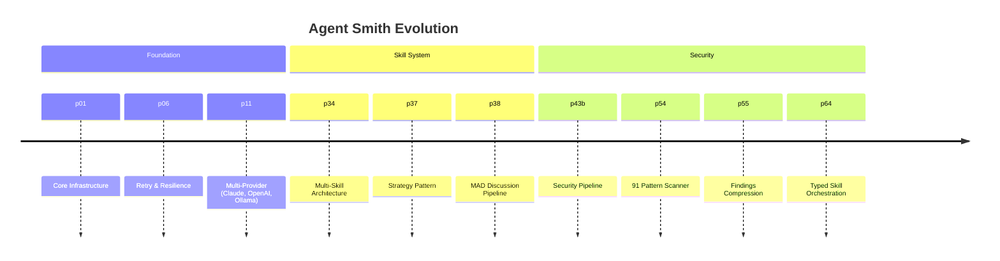
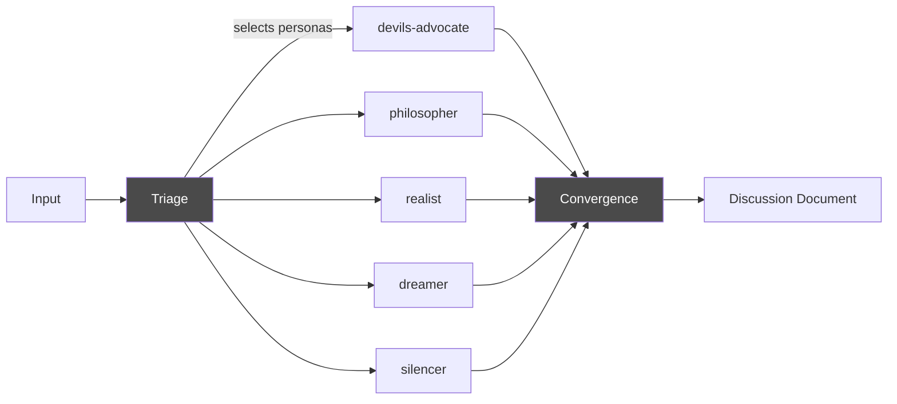
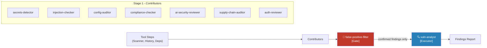
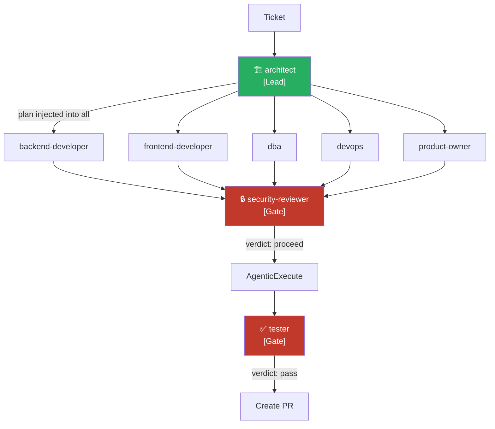
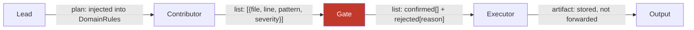

# Phase 66: Docs Enhancement — Self-Documentation & Multi-Agent Orchestration

## Goal

Two things that make docs.agent-smith.org genuinely useful rather than
just technically complete:

1. **Self-Documentation** — make the phase/run methodology visible and
   compelling. Show that Agent Smith documents itself: every extension
   has a why, a cost, and a history.

2. **Multi-Agent Orchestration Explained** — diagrams and clear role
   definitions for the typed skill orchestration introduced in p64.
   A general concept page, linked from every pipeline that uses it.

## Design

Apply the **Linear.app** DESIGN.md from awesome-design-md as the visual
foundation. Dark, precise, developer-focused. Drop it into the project
root before generating any new pages.

```bash
# Fetch from VoltAgent/awesome-design-md
cp design-md/linear/DESIGN.md ./DESIGN.md
```

Then tell the IDE buddy: "Rebuild the MkDocs Material theme overrides
according to this DESIGN.md."

---

## Part 1: Self-Documentation

### New page: `docs/concepts/self-documentation.md`

The central pitch: Agent Smith is the only AI tool that documents its
own evolution in a way humans can read, audit, and extend.

```markdown
# Self-Documentation

Agent Smith doesn't just run tasks — it records why it was built
the way it was. Every feature has a phase. Every phase has a rationale.
Every run has a cost.

## The Three Layers

### Layer 1: Phases (the "what" and "why")
Every capability in Agent Smith originated in a phase document.
Phases live in `.agentsmith/phases/done/` and contain:
- The problem being solved
- Design decisions and alternatives considered
- Definition of done

Example: p64 introduced typed skill orchestration because free-form
discussion produced too much noise. The decision — and its reasoning —
is permanently recorded.

### Layer 2: Runs (the "how much" and "what happened")
Every pipeline execution produces a `result.md`:
- Which commands ran, in what order
- Token usage and cost per step
- Decisions made and their outcomes
- Git diff produced

Example result.md frontmatter:
```yaml
run: r0047
pipeline: security-scan
project: my-api
branch: main
duration: 4m 12s
cost: $0.34
llm_calls: 9
tokens_in: 52196
tokens_out: 12679
findings: 16
```

### Layer 3: Decisions (the "why not")
`decisions.md` captures architectural choices with alternatives
considered and outcomes tracked. Not what was done — why it was
chosen over alternatives.

## Why This Matters

Most AI tools are black boxes. You don't know why they do what they do,
how much it costs, or what they decided not to do.

Agent Smith is an audit trail. Six months after a pipeline ran, you can
answer: what did it find, what did it cost, and why was it built that way.

## Exploring Your Project's History

```bash
# See all phases
ls .agentsmith/phases/done/

# See all runs
ls .agentsmith/runs/

# Query cost history
agent-smith cost --project my-api --last 30 --breakdown

# Find when a decision was made
grep -r "Repository Pattern" .agentsmith/
```
```

---

### Extended page: `docs/concepts/phases-runs.md`

Add a timeline visualization showing the growth of Agent Smith itself
as a real example. Use a Mermaid timeline diagram:



Add cost table — real numbers from actual runs:

| Pipeline | Avg. LLM Calls | Avg. Cost | Output |
|---|---|---|---|
| fix-bug | 8–12 | $0.15–0.40 | PR with code change |
| security-scan | 9 | $0.35 | 16 confirmed findings |
| api-scan | 12 | $0.45 | SARIF + PR comment |
| legal-analysis | 6 | $0.25 | Markdown report |
| mad-discussion | 15 | $0.55 | Discussion document |

---

## Part 2: Multi-Agent Orchestration Explained

### New page: `docs/concepts/multi-agent-orchestration.md`

The central reference for how typed skill orchestration works.
Every pipeline page links here.

#### Section 1: Overview

```markdown
# Multi-Agent Orchestration

Agent Smith coordinates multiple specialized AI skills to analyze,
filter, and synthesize results. Skills don't "discuss" freely —
they have defined roles, typed inputs, and typed outputs.

This approach reduces token costs by ~80% compared to free-form
discussion while producing more reliable, accountable results.
```

#### Section 2: Pipeline Types (with Mermaid diagrams)

**Discussion Pipeline** (MAD, Legal):


**Structured Pipeline** (Security Scan, API Scan):


**Hierarchical Pipeline** (Fix Bug, Add Feature):


#### Section 3: Role Reference

| Role | Symbol | Behavior | Output Type | Veto? |
|---|---|---|---|---|
| `contributor` | ⚙️ | Analyzes its category slice, produces structured list | `list` | No |
| `lead` | 🏗 | Runs first, produces plan injected into all subsequent skills | `plan` | Implicit |
| `gate` | 🧹 | Receives all contributor outputs, filters, blocks on empty result | `list` or `verdict` | **Yes** |
| `executor` | 🔍 | Receives gate output only, produces final artifact | `artifact` | No |

#### Section 4: How Output Types Flow



**Token efficiency:**
- Contributor receives: only its category slice (~800 tokens)
- Gate receives: all contributor JSON outputs merged (~2000 tokens)
- Executor receives: gate-confirmed list only (~1500 tokens)
- vs. today's free discussion: each skill ~5000 tokens = ~40k total

**Result: ~80% token reduction**

#### Section 5: Skill Contract (agentsmith.md)

```yaml
## orchestration
role: gate
runs_after: [contributor]
runs_before: [executor]
output: list

## output_format
{
  "confirmed": [{"file": "", "line": 0, "pattern": "", "severity": "", "reason": ""}],
  "rejected":  [{"file": "", "line": 0, "pattern": "", "reason": ""}]
}
```

---

### Extended pipeline pages

Each pipeline page gets a new section **"How Skills Collaborate"**
with a link to the concept page and a pipeline-specific diagram.

**`docs/pipelines/security-scan.md`** — add:
```markdown
## How Skills Collaborate

Security scan uses the **structured pipeline** pattern.
→ [Multi-Agent Orchestration explained](../concepts/multi-agent-orchestration.md)

[diagram specific to security-scan]

Stage 1 contributors run in parallel, each receiving only their
relevant category slice (secrets, injection, config, etc.).
The false-positive-filter gate confirmed 16 of 332 raw findings
in a real run — eliminating 95% noise.
```

**`docs/pipelines/fix-bug.md`** — add hierarchical diagram.
**`docs/pipelines/api-scan.md`** — add structured diagram.
**`docs/pipelines/legal-analysis.md`** — add discussion diagram.
**`docs/pipelines/mad-discussion.md`** — add discussion diagram.

---

## Navigation Changes (`mkdocs.yml`)

```yaml
nav:
  - Concepts:
      - Pipeline System: concepts/pipeline-system.md
      - Phases & Runs: concepts/phases-runs.md
      - Self-Documentation: concepts/self-documentation.md     # NEW
      - Multi-Agent Orchestration: concepts/multi-agent-orchestration.md  # NEW
      - Decision Logging: concepts/decision-logging.md
      - Cost Tracking: concepts/cost-tracking.md
```

---

## Files to Create

- `docs/concepts/self-documentation.md` — the self-documentation pitch
- `docs/concepts/multi-agent-orchestration.md` — role definitions + all diagrams
- `DESIGN.md` — Linear.app design system (fetched from awesome-design-md)
- `docs/overrides/` — MkDocs Material theme overrides matching DESIGN.md

## Files to Modify

- `docs/concepts/phases-runs.md` — add timeline diagram + cost table
- `docs/pipelines/security-scan.md` — add collaboration section + diagram
- `docs/pipelines/fix-bug.md` — add collaboration section + diagram
- `docs/pipelines/api-scan.md` — add collaboration section + diagram
- `docs/pipelines/legal-analysis.md` — add collaboration section + diagram
- `docs/pipelines/mad-discussion.md` — add collaboration section + diagram
- `mkdocs.yml` — add new pages to navigation

## Definition of Done

- [ ] `self-documentation.md` created with three-layer explanation
- [ ] `phases-runs.md` has timeline Mermaid diagram + cost table
- [ ] `multi-agent-orchestration.md` created with all three pipeline type diagrams
- [ ] Role reference table complete (contributor / lead / gate / executor)
- [ ] Output type flow diagram present
- [ ] Token efficiency numbers documented (real numbers from actual runs)
- [ ] All 5 pipeline pages have "How Skills Collaborate" section with diagram
- [ ] All pipeline diagrams link back to concept page
- [ ] DESIGN.md (Linear.app) in project root
- [ ] MkDocs theme overrides applied — dark, precise, developer aesthetic
- [ ] `mkdocs build --strict` passes (no broken links)
- [ ] `mkdocs serve` — all diagrams render correctly

## Dependencies

- p64 (Typed Skill Orchestration) — must be implemented, provides the content
- p53 (Documentation Site) — already deployed
