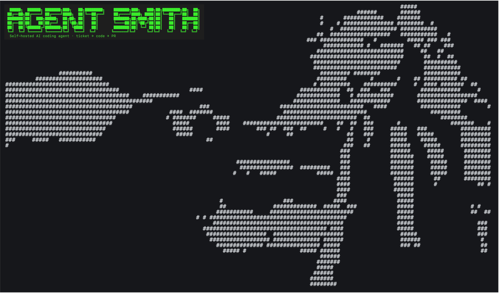

# Agent Smith

> **From ticket to PR.**
> Every run shows its cost. Every change comes with the reasoning the agent followed.

[](https://docs.agent-smith.org)

[](LICENSE)
[](https://dotnet.microsoft.com)
[](Dockerfile)

**[Docs](https://docs.agent-smith.org)** · **[Releases](https://github.com/holgerleichsenring/agent-smith/releases)** · **[Blog](https://codingsoul.org)**

---

Agent Smith is an open source AI coding agent. You drop a ticket into your tracker, and a pull request shows up on your repo, with the ticket already updated to point at it. That's the whole loop.

I built it because most AI coding tools stop at a suggestion in your editor and call it a day. I wanted to close the loop — actual PR, in the actual repo, the ticket actually moved to resolved. Plus a paper trail so six months later I can answer "why did we pick path A over B in this fix" without guessing.


## What it does

You drop a ticket into your tracker. Agent Smith reads it and derives a specification: the phases the work needs and, per phase, what has to be true when it's done. It clones every repo in the project into its own sandbox (each with its own toolchain — a .NET repo gets `dotnet/sdk:8.0`, a Node repo gets `node:20`, a Python worker gets `python:3.12`), works the phases in order, runs the verification each repository declares, opens one pull request per repo with the changes cross-linked, and writes the ticket back with every PR URL in the comment.

Tickets in Azure Boards and code in Azure Repos? That works end to end, no GitHub mirror needed — [the Azure DevOps page](https://agent-smith.org/azure-devops/) says why that matters.

The reasoning lands on disk: the specification under `.agentsmith/specs/`, every choice with the alternative it beat under `.agentsmith/decisions/`, and per run a `result.md` with the delivery account, token usage and dollar cost. Read it six months later when you've forgotten why.

## What decides that a run delivered

Green tests aren't the verdict. After a phase's verification passes, a separate reader goes through its done-list one criterion at a time — met, unmet or not applicable — and has to cite what on the branch proves each one. That account is the only thing the run's verdict listens to. A run that comes back short still opens its pull request, as a draft, with a section naming what was not delivered, and you can overrule a single verdict with a reason that stays on the record. The [delivery account page](https://docs.agent-smith.org/how-it-works/delivery-account/) has the details, and the [lifecycle page](https://docs.agent-smith.org/how-it-works/lifecycle/) walks through a run step by step.

If you'd rather think the change through first, the dashboard's [Work it out](https://docs.agent-smith.org/how-it-works/work-it-out/) page is a conversation with an agent that reads your code while it answers. What you approve there is filed as one ticket, and the run executes exactly that specification.

## The dashboard

A live mission-control view of every run — what's waiting on you, what's in flight, and what finished today, each with its dollar cost and the story of how it got there.


When a run hits a decision it shouldn't make alone, it pauses and asks. Your answer resumes it — no tokens burning while it waits. Every run keeps a five-beat story (ticket → plan → build → verify → outcome) you can open:


Configuration is a picked-not-typed catalog: agents, trackers, repos and connections wired into projects, so a project can never reference something that doesn't exist.


## What it works with

| Trackers | AI providers | Hosting |
|---|---|---|
| Azure DevOps Boards | Anthropic Claude | CLI single-binary |
| Jira | OpenAI | Docker Compose |
| GitHub Issues | Azure OpenAI | Kubernetes |
| GitLab Issues | Google Gemini | |
| | Ollama (local) | |
| | GitHub Copilot (on your seat) | |

The skills — the masters that drive each pipeline and the rules they follow — are developed in a [separate repo](https://github.com/holgerleichsenring/agent-smith-skills), and every release ships with its catalog embedded. The binary you download carries the exact skills it was tested with; there is nothing to pin and nothing to fetch on first run. A `skills:` block in the config is only for overriding that (skills development, air-gap mirrors).

## Built by the method it teaches

Agent Smith bootstraps an `.agentsmith/` directory into your repo: context, phase specs, a decision log, a memory of what it learned. That is the product. It is also how this repository got written, over seven months, by me and one language model. The numbers below are the receipts.

|  |  |
|---|---|
| **968** | completed phases, each specified before a line of code existed |
| **5,062** | recorded decisions, each naming the alternative it beat |
| **432,267** | lines of C# across 4,803 files |
| **7,038** | automated tests, gating every single commit |
| **~650 h** | of human time, roughly 40 minutes per completed phase |

Two things did the actual steering. Ten coding principles turned into [architecture tests](tests/AgentSmith.Tests/Architecture/) that fail a build, and every one of them has a concrete thing that went wrong behind it. Then a [blocking commit hook](.claude/hooks/phase-gate.sh) that lets a phase commit through once the dashboard's build and tests, the backend build, all 7,038 tests, four CLI dry runs and every harness preset come back green. CI would have told me about a break afterwards. The hook stops the commit from existing, and the model has no way to wave itself through.

The `principles.md` I built this project under is the same file Agent Smith injects into its own agents at runtime. The methodology and the product turned out to be the same thing.

**[The full account, including what didn't work](https://docs.agent-smith.org/how-it-works/built-by-the-method/)**: the skill catalog going from 95 down to 12, the plan generator I retired, the metric that quietly read zero for months, and how every figure above was counted.

## Install

```bash
# Linux (x64)
curl -sL https://github.com/holgerleichsenring/agent-smith/releases/latest/download/agent-smith-linux-x64 \
  -o /usr/local/bin/agent-smith && chmod +x /usr/local/bin/agent-smith

# macOS (Apple Silicon)
curl -sL https://github.com/holgerleichsenring/agent-smith/releases/latest/download/agent-smith-osx-arm64 \
  -o /usr/local/bin/agent-smith && chmod +x /usr/local/bin/agent-smith

# Docker (long-running server)
docker pull holgerleichsenring/agent-smith-server:latest
```

Every platform (Linux x64 / ARM64, macOS Intel / Apple Silicon, Windows) is on the [releases page](https://github.com/holgerleichsenring/agent-smith/releases). The [install guide](https://docs.agent-smith.org/get-it-running/install/) walks through CLI / Docker / Kubernetes setups.

## First run

Prove the loop before you connect anything. The only credential the demo needs is an LLM key:

```bash
export OPENAI_API_KEY=sk-...
agent-smith demo
```

That materializes a small sample project with a seeded bug, runs the real `code` pipeline against it, and leaves you a local commit plus the diff. No tracker, no Docker, no Redis — if this works, the loop works.

For your real systems, drop an `agentsmith.yml` in a working directory:

```yaml
agents:
  default-openai:
    type: openai
    model: gpt-4.1        # every role on one model; see AI providers for a model per role

repos:
  todolist:
    type: github
    url: https://github.com/acme-org/todolist
    auth: github_token

trackers:
  acme-issues:
    type: github
    url: https://github.com/acme-org/todolist    # the repo whose issues are the tickets
    auth: github_token

projects:
  todolist:
    agent: default-openai
    tracker: acme-issues
    repos: [todolist]

secrets:
  openai_api_key: ${OPENAI_API_KEY}
  github_token:   ${GITHUB_TOKEN}
```

Set the secrets, let the doctor check the wiring, fix a ticket:

```bash
export OPENAI_API_KEY=sk-...
export GITHUB_TOKEN=ghp_...

agent-smith doctor
agent-smith code --ticket 54 --project todolist
```

`doctor` actually probes everything — it calls the LLM, authenticates against the tracker, spawns a throwaway sandbox — and names what's broken with a fix hint, before a run spends tokens on it. The [first-run page](https://docs.agent-smith.org/get-it-running/first-run/) shows the end-to-end output.

## More than the code pipeline

`code` is the headline because shipping a change is the one most people show up for — one pipeline for bug, feature and phase tickets alike, because what differs between them is the specification it derives, not the steps it runs. The rest of the box:

- `pr-review` — reviews a PR diff and posts line-anchored findings as comments; re-review on push replaces them.
- `security-scan` — a security master reviews the code, reconciles it with the scanners, and every finding it delivers has to survive a refuter.
- `api-security-scan` — Nuclei, Spectral and ZAP against a live API, judged by the same kind of master.
- `legal-analysis` — contract review.
- `mad-discussion` — multi-perspective design discussion when you want to argue something out.
- `init-project` — bootstraps `.agentsmith/contexts/<name>/` per component in each repo of a project.
- `spec-dialog` — the design conversation that ends in a filed ticket with an approved specification.

Same orchestrator, different masters. The [pipeline reference](https://docs.agent-smith.org/reference/pipelines/) has each one.

And two things that took the longest to get right, so I'll name them here: a run doesn't take its own word for being done — every acceptance criterion gets a verdict with evidence from a reader that never saw the work being done. And when a run has a question, it checkpoints and waits — days if needed — without holding a pod. A ticket too thin to work from gets asked, not guessed at. There's also a conversational side ([Work it out](https://docs.agent-smith.org/how-it-works/work-it-out/) in the dashboard, or [Slack and Teams](https://docs.agent-smith.org/how-it-works/spec-dialogue/)): talk the change through, approve the specification, and it files the ticket.

## Where the docs are

- **[Get it running](https://docs.agent-smith.org/get-it-running/install/)** — install + first run (`demo`, `doctor`).
- **[Connect your stuff](https://docs.agent-smith.org/connect-your-stuff/tracker-azure-devops/)** — tracker + repos + AI provider, with a copy-pasteable YAML per system.
- **[Trigger it](https://docs.agent-smith.org/trigger-it/webhooks/)** — webhooks, polling, labels, CLI.
- **[Host it](https://docs.agent-smith.org/host-it/docker-compose/)** — CLI, Docker Compose, Kubernetes with honest capacity quotas.
- **[How it works](https://docs.agent-smith.org/how-it-works/methodology/)** — the spec-first methodology, the delivery account, Work it out.
- **[Dashboard](https://docs.agent-smith.org/reference/operations/dashboard/)** — watch runs live: every step, every LLM call with its cost and cached share, a cancel button that means it.

## License

MIT. Copyright (c) 2026 Holger Leichsenring.

If you find Agent Smith useful, [say hi on the blog](https://codingsoul.org) or [drop an issue](https://github.com/holgerleichsenring/agent-smith/issues).
