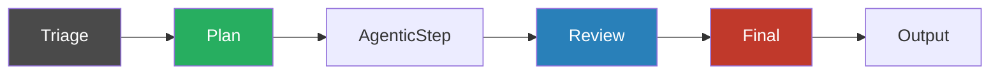

# Multi-Agent Orchestration

Agent Smith coordinates multiple specialized AI skills to analyze, plan, review, and synthesize results. Each skill has typed inputs, typed outputs, and a role that's assigned per ticket by the [triage step](triage.md).

The model has two layers: **roles** (what a skill does in a given run) and **phases** (when in the pipeline a role acts).

## Roles

| Role | What it does | Output | Veto? |
|---|---|---|---|
| `Lead` | Sets the plan downstream skills compare against. One per phase. | `plan` (typed observations) | No |
| `Analyst` | Contributes perspective. No veto power. | `list` of observations | No |
| `Reviewer` | Compares actual code/diff against the plan. Evidence-required. | `list` of observations | No |
| `Filter` | Reduces a finding list (drops duplicates/false positives) or synthesizes a final artifact. | `list` or `artifact` | No |

A single skill may declare multiple supported roles (`roles_supported: [lead, analyst, reviewer]`); triage picks one role per phase based on activation criteria.

## Phases

Structured pipelines (`fix-bug`, `add-feature`, `security-scan`, `api-security-scan`) declare three phases.

| Phase | Round # | Typical roles | What happens |
|---|---|---|---|
| `Plan` | 1 | Lead, Analysts | Lead emits a plan; analysts contribute perspective. |
| `AgenticStep` | — | (no triage roles) | Developer agent writes code following the plan. Only in `fix-bug` / `add-feature`. |
| `Review` | 2 | Lead (sometimes), Reviewers | Reviewers compare diff against the plan via `{{plan}}` template token. |
| `Final` | 3 | Filter | Reduces or synthesizes the run's output. |

For `security-scan` and `api-security-scan` the `AgenticStep` is omitted — they read-only-scan, so phases run back-to-back.

For `legal-analysis`, `mad-discussion`, `init-project`, `skill-manager`, and `autonomous`, triage falls back to the legacy LLM strategy that picks Lead + Participants. Phases don't apply; the run is one open round driven by `ConvergenceCheck`.

## Plan artifact threading

After the Plan phase, the Lead's observations are stored in `PipelineContext` as a `PlanArtifact`. Review-phase skills with a `{{plan}}` placeholder in their `## as_reviewer` body get it substituted at prompt-build time. Reviewers without a same-run lead see `(no plan provided)` and run as generic reviewers.

## Confidence threshold

Every observation carries a `Confidence` (0–100) and `Blocking` flag. Observations with `Blocking=true` and `Confidence<70` are auto-downgraded to `Blocking=false` with a structured log entry. The high-confidence threshold prevents speculation from breaking the pipeline; low-confidence concerns still surface in the final report but don't gate.

## Filter mode

Filter skills execute as a separate `FilterRoundCommand` (not a `SkillRoundCommand`). The output mode is read from `output_contract.output_type[Filter]`:

- `List` → the LLM returns a reduced JSON observation list; the framework replaces the in-context observation list with the reduced one (IDs reassigned).
- `Artifact` → the LLM returns synthesized text; the framework stores it under `SkillOutputs[skillName]` for downstream consumption (final report, deliver step).

Unlike the legacy `Gate` role, Filter has no veto. Reductions and syntheses are observable and downstream pipeline steps continue regardless.

## Skill contract

Skills declare their roles, activation criteria, and output contract in `SKILL.md` frontmatter. See the [skills.md reference](../configuration/skills.md) and the [migration guide](../configuration/skills/migration.md) for the full schema and a before/after example.

The legacy `agentsmith.md` `## orchestration` section, the `OrchestrationRole` enum (`Lead`/`Contributor`/`Gate`/`Executor`), and the deterministic `SkillGraphBuilder` are all retired in p0111c. The current pipeline order is decided per ticket by the LLM-driven triage step, not by topological sort over skill metadata.

## Pipelines using this pattern

| Pipeline | Triage strategy | Phases |
|---|---|---|
| `fix-bug`, `add-feature`, `fix-no-test` | Structured | Plan → AgenticStep → Review → Final |
| `security-scan` | Structured | Plan → Review → Final |
| `api-security-scan` | Structured | Plan → Review → Final |
| `legal-analysis`, `mad-discussion` | Legacy (Discussion) | Single open round |
| `init-project`, `skill-manager`, `autonomous` | Legacy (Discussion) | Single open round |
