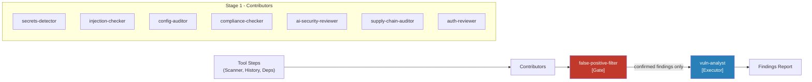
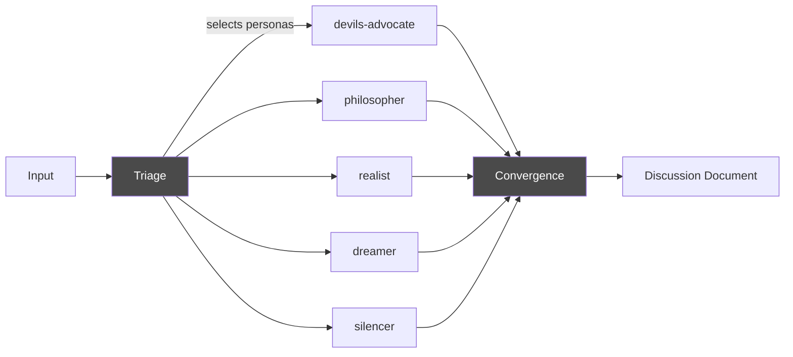
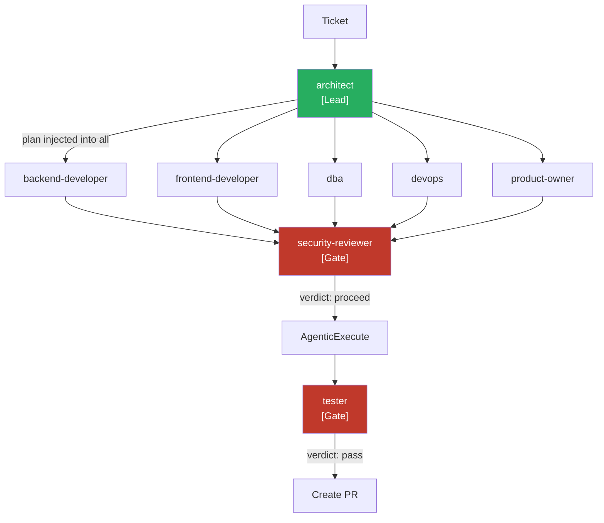
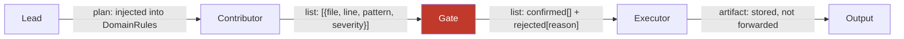

# Multi-Agent Orchestration

Agent Smith coordinates multiple specialized AI skills to analyze, filter, and synthesize results. Skills don't "discuss" freely — they have defined roles, typed inputs, and typed outputs.

This approach reduces token costs by approximately 80% compared to free-form discussion while producing more reliable, accountable results.

## Pipeline Types

Agent Smith uses three orchestration patterns, each suited to different kinds of work.

### Structured Pipeline (Security Scan, API Scan)

Tool steps produce raw findings. Contributors analyze their category slice in parallel. A gate filters false positives. An executor synthesizes the final report.



**Real numbers** (security-scan on Agent Smith, 2026-04-09):

- 207 raw findings from static scan (188), git history (18), dependencies (1)
- 7 contributors analyzed category-sliced findings in parallel
- Gate confirmed **16 of 207** findings — 92% noise eliminated
- 9 LLM calls, 64,875 tokens, **$0.35**
- Duration: 3 minutes 51 seconds

### Discussion Pipeline (MAD, Legal Analysis)

Personas with different perspectives debate a topic. A triage step selects participants. Convergence checking determines if another round is needed.



Each persona responds with AGREE, OBJECTION, SUGGESTION, or SILENCE. If objections remain, another round runs. Maximum 3 rounds by default.

### Hierarchical Pipeline (Fix Bug, Add Feature)

A lead skill produces a plan that gets injected into all subsequent skills. Gates can block progression.



The lead's plan becomes part of every contributor's domain rules, ensuring all skills work toward the same architecture.

## Role Reference

Every skill in a pipeline has one of four roles. The role determines when it runs, what it receives, and whether it can block the pipeline.

| Role | Symbol | Behavior | Output Type | Veto? |
|---|---|---|---|---|
| `contributor` | ⚙️ | Analyzes its category slice, produces structured list | `list` | No |
| `lead` | 🏗 | Runs first, produces plan injected into all subsequent skills | `plan` | Implicit |
| `gate` | 🧹 | Receives all contributor outputs, filters, blocks on empty result | `list` or `verdict` | **Yes** |
| `executor` | 🔍 | Receives gate output only, produces final artifact | `artifact` | No |

## How Output Types Flow

Skills communicate through typed JSON. Each stage receives only what it needs.



### Token Efficiency

The structured pipeline dramatically reduces token consumption by giving each skill only its relevant slice:

| Stage | Receives | Typical tokens |
|---|---|---|
| Contributor | Only its category slice | ~800 |
| Gate | All contributor JSON outputs merged | ~2,000 |
| Executor | Gate-confirmed list only | ~1,500 |

Compare to free-form discussion where each skill receives ~5,000 tokens (all findings + full discussion log), totaling ~40,000 tokens for 9 skills.

**Result: ~80% token reduction** with more reliable, reproducible output.

## Skill Contract (agentsmith.md)

Each skill declares its role and execution order in its YAML metadata:

```yaml
## orchestration
role: gate
runs_after: [contributor]
runs_before: [executor]
output: list

## output_format
{
  "confirmed": [{"file": "", "line": 0, "pattern": "", "severity": "", "reason": ""}],
  "rejected":  [{"file": "", "line": 0, "pattern": "", "reason": ""}]
}
```

The `SkillGraphBuilder` reads these declarations and constructs a deterministic execution graph — no LLM call needed for triage. Skills are topologically sorted into stages based on `runs_after`/`runs_before` dependencies.

## Pipelines Using This Pattern

Each pipeline page has a "How Skills Collaborate" section with a pipeline-specific diagram:

- [Security Scan](../pipelines/security-scan.md) — structured pipeline, 9 skills
- [API Scan](../pipelines/api-scan.md) — structured pipeline, 4 skills
- [Fix Bug / Add Feature](../pipelines/fix-and-feature.md) — hierarchical pipeline
- [Legal Analysis](../pipelines/legal-analysis.md) — discussion pipeline, 5 roles
- [MAD Discussion](../pipelines/mad-discussion.md) — discussion pipeline, 5 personas
