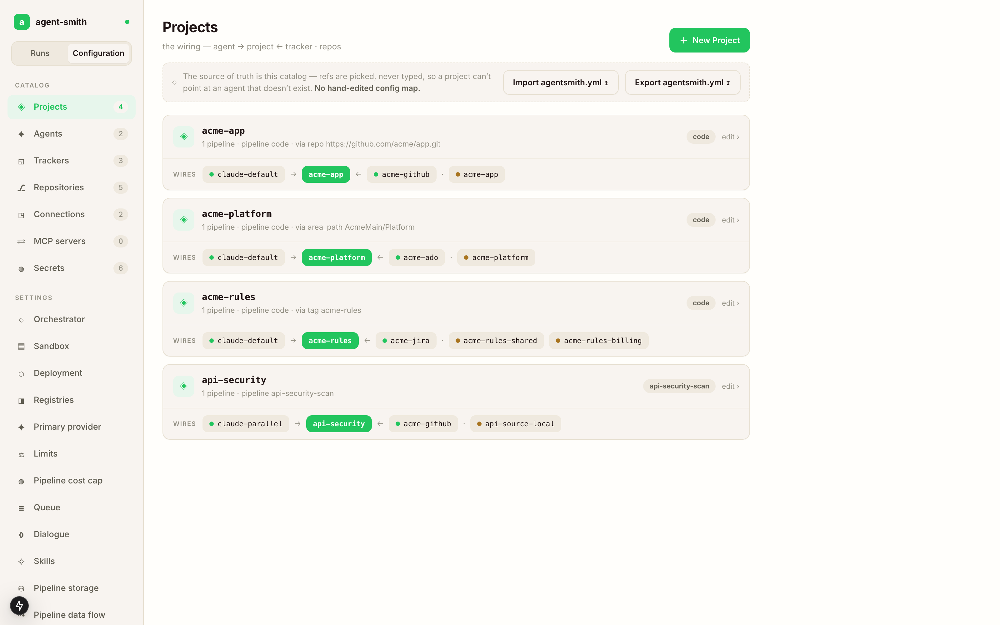
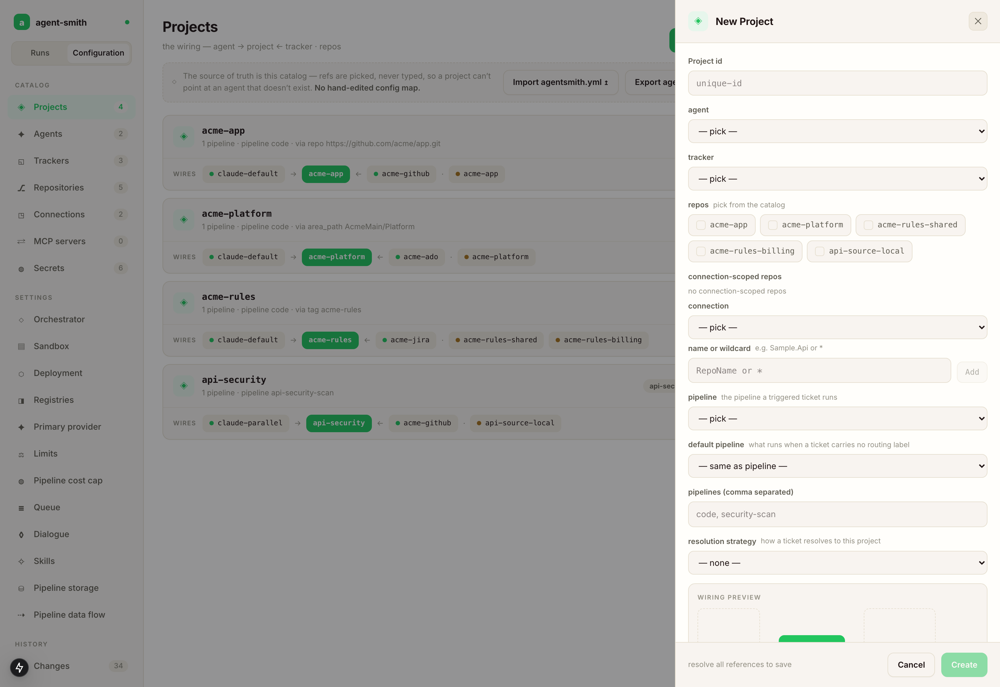
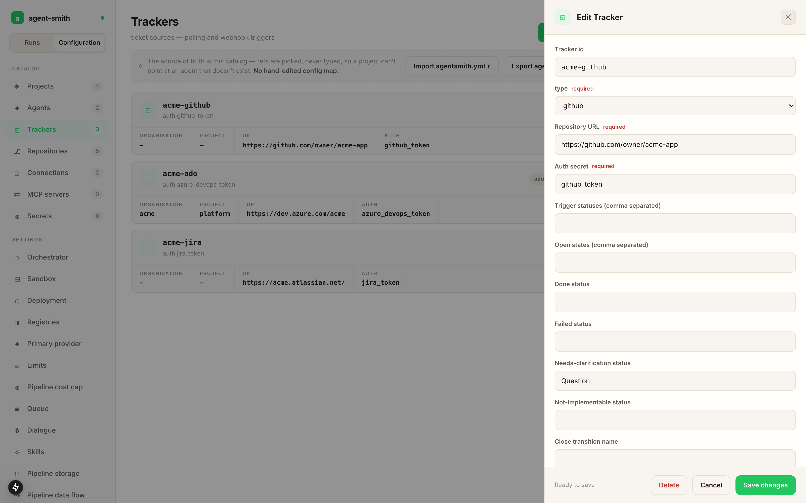
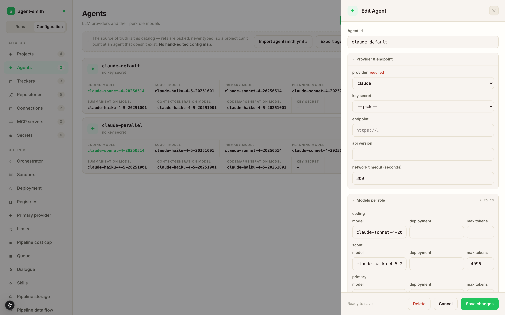
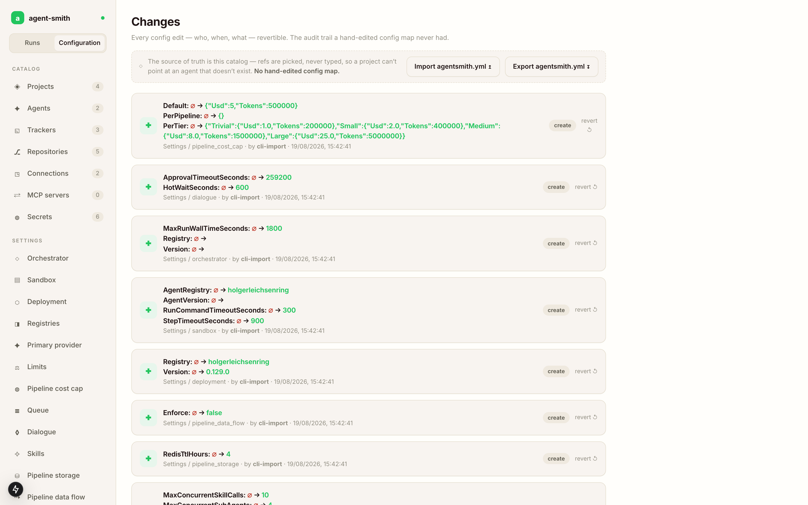

# The Config studio

The dashboard has two halves. The **Runs** side is where you watch work happen. The **Configuration** side is where you decide what work is possible. Toggle between them at the top of the left rail, or go straight to `/config`.

The rail is split the same way the configuration is: a **catalog** of things that exist, then the global **settings** that apply to all of them, then the change history. Counts next to each catalog tell you how many entries you have, which is a surprisingly good smoke test after an import.

## The seven catalogs

| Catalog | What lives in it |
|---|---|
| Projects | the wiring: one agent, one tracker, a set of repos, and how tickets route here |
| Agents | LLM providers and the model they use per role |
| Trackers | ticket sources, their workflow states, and their trigger behavior |
| Repositories | individual repos the pipelines clone and push to |
| Connections | repo discovery scopes, an org or project plus its auth, so you don't list 40 repos by hand |
| MCP servers | external MCP tool servers |
| Secrets | the env var *names* your config refers to, with values staying in the runtime environment |

Secrets deserve the emphasis. The studio stores the name `github_token` and the fact that something references it. The actual token lives in your environment or your k8s Secret, and it never enters the database or an export.

## Adding something

Every catalog has a **New** button in the top right, and every entry has an **edit** on its card. Both open the same drawer.

Look at what the drawer does with references. `agent`, `tracker` and `connection` are dropdowns that list what you actually have. Repos are checkboxes over the repo catalog. Every reference is picked from the catalog, which closes off the single most common way a hand edited config map breaks a deployment at 2am. The footer says `resolve all references to save` and keeps **Create** disabled until they do.

Underneath the fields there's a wiring preview that draws the same `agent → project ← tracker · repos` shape you see on the card, updating as you pick. It's the fastest way to catch "I wired the staging tracker to the production repo" before saving rather than after.

The fields themselves come from the backend. Pick `type: github` on a tracker and you get Repository URL. Pick `azure_devops` and you get organization and project instead. That list of types is served from the same registry the runtime resolves against, so everything you can pick is something the server can actually construct.

## Agents and their roles

An agent is a provider plus a model per role, and the drawer shows all seven roles: coding, scout, primary, planning, summarization, contextgeneration, codemapgeneration. Each takes a model, an optional deployment name for Azure's per deployment routing, and an optional max tokens.

The optional sections (pricing, cache, compaction, retry) stay collapsed and absent until you add them, so an agent you never touched keeps a clean record instead of a wall of persisted defaults. Pricing is worth adding if you care about the dollar figures on every run. Without it the run still records tokens, it just can't price them.

## Changes and revert

Every write lands in the change feed with the fields it touched, the old value, the new value, who did it, and when.

Each row has a revert. That's the thing a mounted ConfigMap never gave you. Someone widened a cost cap three weeks ago, the run bills went up, and you can find the exact edit and undo it without reconstructing what the file used to say from git history that may not exist.

## What the studio does not carry

Two blocks are honest gaps rather than design:

- `pipeline_triggers:`, the global label to pipeline map. It's stored in the database and the server serves it, but there's no catalog screen for it yet. To change it: export, edit the block, import with `--force`.
- `trace:`, whether a run records its full conversation. Read from `agentsmith.yml` in both modes.

Everything else you'd want to change day to day is here or under [Settings](settings.md).
