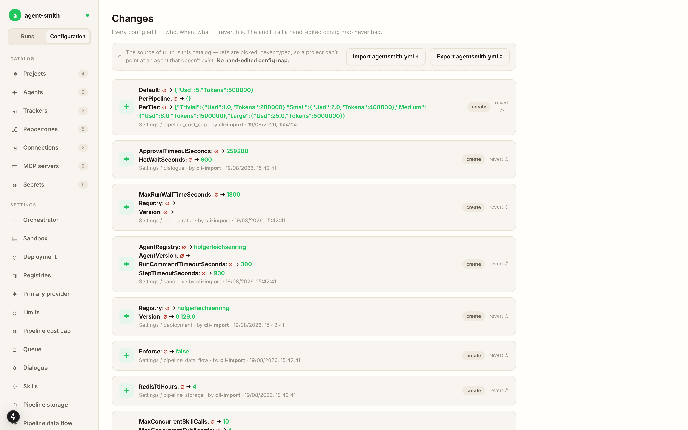

# Where configuration lives

There are two ways Agent Smith gets its configuration, and which one you're in decides everything else on these pages.

Run it as a **server**, so docker-compose or Kubernetes or anything else long-lived, and the database is the store of record. You edit it in the Configuration studio in the dashboard, and the server picks the change up while it runs. Run it as the **CLI**, one shot at a time, and it reads `agentsmith.yml` from disk, the whole file.

Why not the file for the server too? Because on Kubernetes the file is a mounted ConfigMap, mounted ConfigMaps are read only, and a studio save against one would be a no-op. So the database holds the configuration, and the file keeps the one job only a file can do. If you've been copying config blocks into a mounted ConfigMap and wondering why nothing happened, this page is the answer.

## What a server reads from the file

At boot the server reads the bootstrap slice out of `agentsmith.yml`:

```yaml
persistence:
  provider: sqlite                 # sqlite | postgresql | mysql | sqlserver
  connection_string: "Data Source=/var/lib/agentsmith/agentsmith.db"

secrets:
  anthropic_api_key: ${ANTHROPIC_API_KEY}
  github_token:      ${GITHUB_TOKEN}
```

It's a chicken and egg thing. The connection to the database can't live in the database it describes, and the names of your secret environment variables have to be known before anything else loads. The optional `auth:` block (the token authority for dashboard sign-in) is read from the file for the same reason. Everything else (agents, trackers, connections, repos, projects, MCP servers, and the global settings groups) comes out of the database.

The database connection can also come from the environment instead of the file. Set both `AGENTSMITH_PERSISTENCE_PROVIDER` and `AGENTSMITH_PERSISTENCE_CONNECTION` and they replace the whole `persistence:` block; [agentsmith.yml](yaml.md#as-a-server-bootstrap) has the details and the one trap.

So a server that boots with a full `agentsmith.yml` mounted at `/app/config/agentsmith.yml` will use the bootstrap slice and ignore the rest. The file isn't validated against what's in the database, and nothing warns you that the `projects:` block you just edited is inert. Put the catalog into the database instead, one of the two ways below.

## Getting an existing YAML into the database

If you already have a working `agentsmith.yml`, import it. Once:

```bash
agent-smith config import ./agentsmith.yml
```

The import is guarded. It refuses to run against a store that already has content unless you pass `--force`, so the destructive version is one you type on purpose. `persistence:` is deliberately excluded from the import, since it stays in the file where the bootstrap can find it. An import that carries two spellings of one name (`TodoList` and `todolist` as two projects, say) is refused as a whole and names both; see [names are case-insensitive](config-studio.md#names-are-case-insensitive).

The studio has the same thing as a button (**Import agentsmith.yml**, top of every catalog page), and the other direction too, **Export agentsmith.yml**, or from the command line:

```bash
agent-smith config export --output ./agentsmith-backup.yml
```

Export gives you back a file that round-trips through the real loader, which makes it a backup, a code review artifact, and the thing you hand to a second environment. Secrets come out as env var names, never values.

## Every edit is attributed and revertible

The studio writes a change record for each edit: who, when, which fields, old value to new value. The Changes view lists them newest first, and each one has a revert button.



The screenshot above is a fresh instance right after `agent-smith config import`, which is why every row says `by cli-import`. Edits from the studio carry the operator instead.

A config write also bumps a counter in Redis, and the running server watches it. Change a tracker's polling interval and the poller picks it up on its next cycle, with no restart in the loop. The exceptions are the bootstrap slice (change `persistence:` and you're restarting the process, by definition) and the handful of settings the [Settings](settings.md) page marks as read at startup.

## Which surface owns which block

| Block | Server (docker / k8s) | CLI |
|---|---|---|
| `persistence:` | the file (or the two env vars), read at boot | unused |
| `secrets:` `auth:` | the file, read at boot | the file |
| `agents:` `trackers:` `connections:` `repos:` `projects:` `mcp_servers:` | database, via the [Config studio](config-studio.md) | the file |
| `deployment:` `sandbox:` `orchestrator:` `queue:` `limits:` `skills:` `dialogue:` `registries:` `primary_provider:` `pipeline_cost_cap:` `pipeline_storage:` `pipeline_data_flow:` | database, via [Settings](settings.md) | the file |
| `pipeline_triggers:` | database, with no studio page, so import or export to edit it | the file |
| `trace:` | not read; set `AGENTSMITH_TRACE` on the server process | the file, and `AGENTSMITH_TRACE` wins over it |
| `tool_runner:` | `config/agentsmith.yml` under the working directory | the same |

The last three rows are the exceptions. `pipeline_triggers:` is stored and served like everything else but has no catalog screen, so you edit it by exporting, changing the block, and importing with `--force`. `trace:` isn't part of the stored configuration at all; on a server the environment variable is the switch. `tool_runner:` (how the api-scan tools are started, see [Tool configuration](../reference/configuration/tools.md)) is read straight from the file in both modes.

## Next

- [The Config studio](config-studio.md), the catalogs, the project drawer, and what the studio refuses to let you save.
- [Project templates](templates.md), building one project's contexts after another project's.
- [Settings](settings.md), the twelve global groups and what each one actually changes.
- [agentsmith.yml](yaml.md), the file itself: bootstrap, CLI, import/export, schema.
