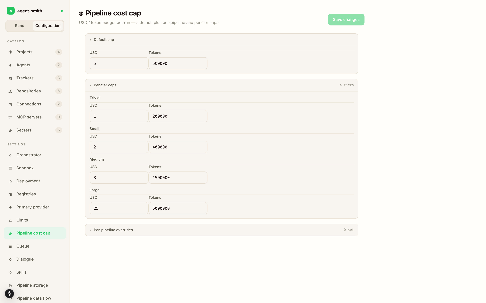

# Settings

Below the catalogs in the studio rail sit twelve global settings groups. Each one is a typed form over a block that used to be a top level section of `agentsmith.yml`, and each one applies to every project unless a project overrides it.

They save the same way the catalogs do: one **Save changes**, a row in the change feed, and a live pickup by the running server.

## What each group changes

### Orchestrator

The orchestrator container image pin, and `MaxRunWallTimeSeconds`, the ceiling on how long one run may take before it gets killed. If you've ever had a run wander for two hours, this is the knob.

### Sandbox

The sandbox agent image, plus two timeouts: one per step and one per command. A repo whose test suite takes twelve minutes needs the command timeout raised, and the symptom when you haven't is a command that dies at the same second every time.

### Deployment

A single registry plus version that feeds *both* the orchestrator and the sandbox agent image when the two groups above leave theirs unset. This is the one you bump on upgrade. The other two exist for the case where you want to pin one of them independently.

### Registries

Private package feeds the agent authenticates against inside the sandbox, so `dotnet restore` or `npm install` against your internal feed works without baking credentials into a toolchain image.

### Primary provider

The agent used when a project doesn't name one.

### Limits

The ceilings on one agentic loop: tool calls, tokens, sub agents, concurrent skill calls. These stop a confused loop from grinding, and they apply per skill rather than per run.

### Pipeline cost cap

The money one. A default cap in USD and tokens, four tier caps (trivial, small, medium, large) applied by the estimated size of the work, and optional per pipeline overrides. A run that hits its cap stops and says so.

### Queue

Consumer backpressure, and how often the queue retries against Redis.

### Dialogue

How long a run waits for you. `HotWaitSeconds` is the window it holds the sandbox open expecting a fast answer. `ApprovalTimeoutSeconds` is how long the question stays answerable before the run gives up. The defaults are ten minutes and three days.

### Skills

Where the skill catalog is resolved from. Every release ships with its catalog embedded, so this is an override for skills development or an air gapped mirror, and most deployments never touch it.

### Pipeline storage

How long in flight run artifacts stay in Redis.

### Pipeline data flow

Whether the data flow gate warns or enforces.

## Two things the settings rail leaves out

`persistence:` is absent on purpose. It's bootstrap only, read from the file before the server can talk to a database, so making it editable in a UI backed by that database would be a circle. Change it in `agentsmith.yml` and restart.

`secrets:` is absent because it has its own catalog. The studio holds names, and values stay in the environment.
