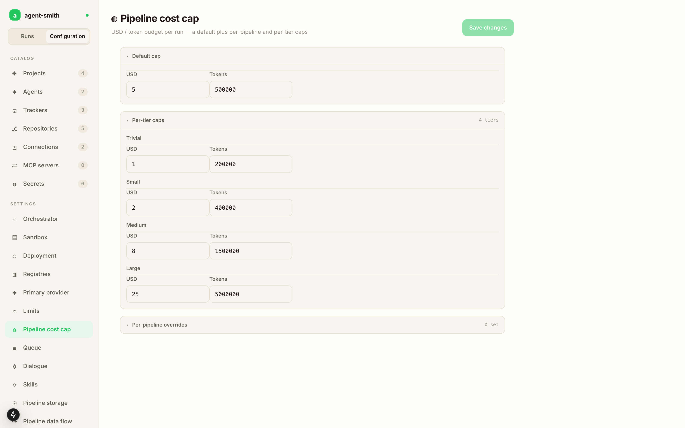

# Settings

Below the catalogs in the studio rail sit twelve global settings groups. Each one is a typed form over a top level block of `agentsmith.yml`, and each one applies to every project unless a project overrides it.

They save the same way the catalogs do: one **Save changes**, a row in the change feed, and a live pickup by the running server, except where a field says it applies after a restart.

## What each group changes

### Orchestrator

The orchestrator container image pin, and `MaxRunWallTimeSeconds`, the ceiling on how long one run may take before it gets killed. It defaults to 1800, so a run that is still going after thirty minutes is stopped. Raise it for a codebase where a legitimate run genuinely takes longer, and lower it if you would rather find out early.

### Sandbox

The sandbox agent image (registry and version) plus two timeouts, `StepTimeoutSeconds` at 900 and `RunCommandTimeoutSeconds` at 300. The two are one rule: a `run_command` gets the command timeout when it asks for none, may ask for more, and is killed at the step cap. So the step cap is the ceiling a command may request, and raising it raises what a command may ask for; the command timeout can't be set above it. A repo whose test suite runs longer than five minutes needs the command timeout raised, and the symptom when you haven't is a command that reports it timed out at the same second every time.

Leave the agent version empty and the sandbox agent tag is derived from the release the running server is, so the two can't drift apart by being forgotten. Set it only to pin a different published tag on purpose (an air-gapped mirror carrying one release, say); a pin is reported as an advisory finding, never refused.

The image pin and the two timeouts are read from an instance built at startup, so they need the server restarted. Two fields in this group apply without one:

- `MaxConcurrentSandboxes`: the Docker capacity probe reads it each time it decides whether a run fits. The field is optional (the same key is `max_concurrent_sandboxes` in `agentsmith.yml`), and left empty it falls back to the `SANDBOX_MAX_CONCURRENT` environment variable, then to the built-in default of 2. `0` means unbounded. It bounds the **Docker** backend only: a Kubernetes installation bounds sandboxes through its namespace `ResourceQuota` and the in-process backend is unbounded. The full story is on the [capacity page](../reference/operations/capacity.md#where-the-concurrent-sandbox-bound-is-set).
- Sandbox hold (seconds): how long a design conversation keeps the source sandboxes it opened after a turn, so the next question doesn't pay for the clone again. Empty falls back to `SANDBOX_HOLD_SECONDS`, then 180; `0` holds nothing. A project can override it on its own sandbox tab.

Every one of these except `MaxConcurrentSandboxes` can be overridden per project in the project drawer's sandbox tab (see [The Config studio](config-studio.md#the-project-drawer)). Registry allow-lists, image pull secrets and what the hold does to capacity live with the rest of the sandbox model on [Sandbox architecture](../reference/concepts/sandbox-architecture.md).

### Deployment

A single registry plus version that feeds *both* the orchestrator and the sandbox agent image when the two groups above leave theirs unset. This is the one you bump on upgrade. The other two exist for the case where you want to pin one of them independently.

### Registries

Private package feeds the agent authenticates against inside the sandbox, so `dotnet restore` or `npm install` against your internal feed works without baking credentials into a toolchain image.

### Primary provider

The agent used when a project doesn't name one.

### Limits

The ceilings on one agentic loop: tool calls, tokens, sub agents, concurrent skill calls. These stop a confused loop from grinding, and they apply per skill rather than per run.

### Pipeline cost cap

The money one. A default cap in USD and tokens, four tier caps (trivial, small, medium, large) applied by the estimated size of the work, and optional per pipeline overrides. A run that hits its cap stops and says so.

### Queue

Consumer backpressure, and how often the queue retries against Redis.

### Dialogue

How long a run waits for you. `HotWaitSeconds` is the window it holds the sandbox open expecting a fast answer. `ApprovalTimeoutSeconds` is how long the question stays answerable before the run gives up. The defaults are ten minutes and three days.

The same block carries `dashboard_url`, your dashboard's address, so the ticket comment that asks a question links to the run's page. Without it the comment carries no link. The form has no field for it; set it through import.

### Skills

Where the skill catalog is resolved from. Every release ships with its catalog embedded, so there is nothing to pin here. It exists as an override for skills development and for air gapped mirrors.

### Pipeline storage

How long in flight run artifacts stay in Redis.

### Pipeline data flow

Whether the data flow gate warns or enforces.

## Two things the settings rail leaves out

`persistence:` is absent on purpose. It's bootstrap only, read from the file before the server can talk to a database, so making it editable in a UI backed by that database would be a circle. Change it in `agentsmith.yml` and restart.

`secrets:` is absent because it has its own catalog. The studio holds names, and values stay in the environment.
