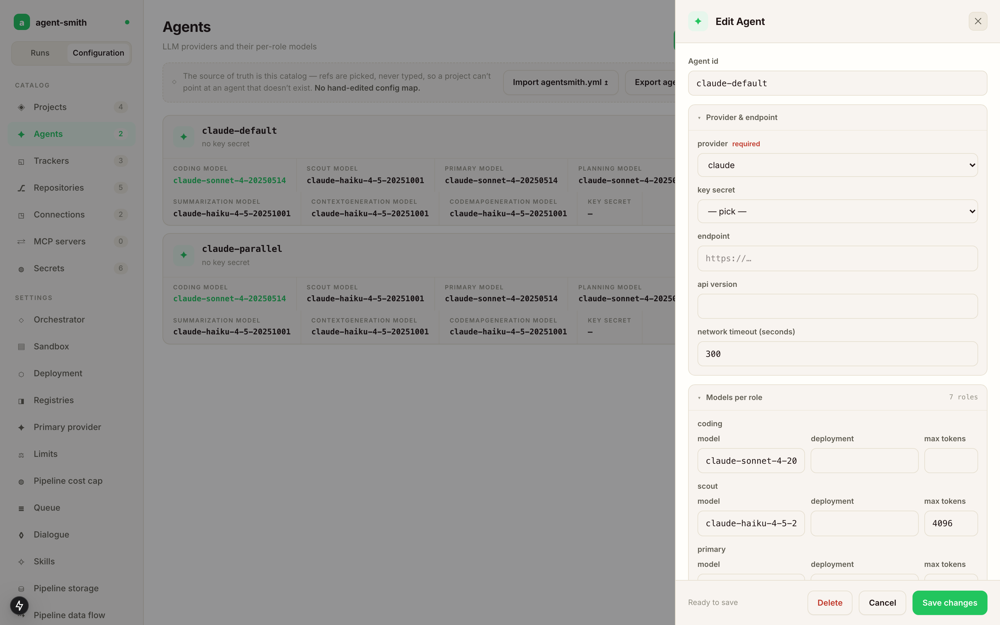

# Connect your AI provider

Agent Smith calls the AI provider directly from your infrastructure — no SaaS in between, no proxy. Pick the one you have an API key for (or run Ollama for fully local).

An agent is a provider plus a model per role, and it gets an id that projects reference. You can register several (a Claude one and a local Ollama one for cost sensitive runs, say) and pick per project.

Where you create it depends on how you run Agent Smith. On a server it's the **Agents** catalog in the [Config studio](../configure-it/config-studio.md): New agent, pick the provider, and the form asks for exactly the fields that provider needs. The provider list comes from the server's own registry, so anything you can pick is something the runtime can actually construct.



For the CLI, and for `agent-smith config import`, the same thing is an entry under `agents:` in `agentsmith.yml`. Every block below is that YAML form, and the field names match the labels in the drawer one to one.

## Model roles

Agent Smith uses different models at different points in a run. Each agent block has a `models:` map with one entry per role:

| Role | What it does | Model size that makes sense |
|---|---|---|
| `scout` | Walks the codebase with tools, picks relevant files. High call volume. | Cheap. `gpt-4.1-mini`, `claude-haiku`, `gemini-flash`. |
| `primary` | Writes the code, reviews, makes the actual changes. | The good one. `gpt-4.1`, `claude-sonnet`, `gemini-pro`. |
| `planning` | Derives the spec from the ticket, drafts expectations, decides which repos a ticket touches. | Usually same as `primary`. |
| `reasoning` | Judgement calls: accounting a delivery against its criteria, refuting scan findings, reviewing a phase diff, parsing a chat intent. Optional. | Same as `primary`. |
| `summarization` | Folds the older part of a long conversation into a summary (see [Context compaction](../reference/concepts/context-compaction.md)). | Cheap. `*-mini` / `*-haiku`. |
| `code_map_generation` | Drives the repository analyzer, which explores the repo with tools and writes the code map. Optional. | Cheap. |
| `context_generation` | Drives the two `init-project` rounds that read the repository through tools: discover its components, then write each `.agentsmith/contexts/<name>/context.yaml`. Optional. | The good one. Same as `primary`. |

How a role you leave out is resolved:

- With no `models:` block at all, every role runs on the agent's own `model`.
- `reasoning` and `context_generation` fall back to `primary`.
- `code_map_generation` falls back to `scout`, so the repository sweep stays on the cheap model unless you say otherwise.
- `scout`, `planning` and `summarization` do not fall back to `primary`. Left out of a `models:` block, they get built-in Claude model names. On any other provider, set all four of `scout`, `primary`, `planning` and `summarization`.

A run needs a provider `type` and a model, either as `model` or as `models.primary.model`. The run preflight refuses to start without them.

## API keys

Every provider reads its key from an environment variable. `api_key_secret` on the agent names that variable; without it each provider falls back to its usual one:

| `type` | Fallback variable |
|---|---|
| `claude` (alias `anthropic`) | `ANTHROPIC_API_KEY` |
| `openai` | `OPENAI_API_KEY` |
| `azure_openai` | `AZURE_OPENAI_API_KEY` |
| `gemini` (alias `google`) | `GEMINI_API_KEY`, then `GOOGLE_API_KEY` |
| `copilot` | `COPILOT_GITHUB_TOKEN`, then `GH_TOKEN`, then `GITHUB_TOKEN` |
| `ollama`, `external_worker` | none |

Two agents that name two different variables can use two different keys in one installation.

## Anthropic Claude

Direct Anthropic API, with prompt caching on by default. Subscription OAuth tokens (`sk-ant-oat01-…`) work as the key too, which is handy if your Claude usage is subscription-funded rather than API-billed. Note the conservative default rate limits below.

```yaml
agents:
  default-claude:
    type: claude
    cache: { is_enabled: true, strategy: automatic }   # default, leave it on
    retry: { max_retries: 5, initial_delay_ms: 2000, backoff_multiplier: 2.0 }
    compaction: { is_enabled: true, keep_recent_iterations: 3 }
    models:
      scout:   { model: claude-haiku-4-5-20251001 }
      primary: { model: claude-sonnet-4-6 }
      planning:      { model: claude-sonnet-4-6 }
      summarization: { model: claude-haiku-4-5-20251001 }
```

Prompt caching marks the system prompt and the tool definitions, and on Claude it also marks the latest message, so the growing conversation history is read from cache on the next iteration instead of being paid for again. Setting `cache.is_enabled: false` sends no cache directive at all. The cached share is recorded per LLM call and visible in the dashboard's cost breakdown. A caching-enabled run showing 0% cached means the cache is dead; treat that as an alarm. See [Cost tracking](../reference/concepts/cost-tracking.md).

## Rate limits, retries and timeouts (all providers)

Three knobs on the agent block you'll want to know exist before they bite:

```yaml
agents:
  default-claude:
    # ...
    rate_limit:
      requests_per_minute: 50
      input_tokens_per_minute: 40000
    retry:
      max_retries: 5            # default 5
      initial_delay_ms: 2000    # default 2000
      backoff_multiplier: 2.0   # default 2.0
      max_delay_ms: 60000       # default 60000
    network_timeout_seconds: 300   # default; per-call HTTP timeout for OpenAI and Azure OpenAI
```

The framework rate-limits itself per (provider, model) with token buckets on requests and estimated input tokens, so a parallel scan doesn't slam into the provider. When `rate_limit` is unset, a default is picked from the agent type: 50 requests / 40k input tokens per minute for a Claude API key, 5 / 20k for a Claude subscription OAuth token, 60 / 60k for OpenAI, Azure OpenAI and Copilot. If runs feel throttled, set `rate_limit` to your actual tier. `agent-smith doctor` calls this out.

When the provider still answers 429, the call is retried within `retry.max_retries`, and every wait is logged with its reason. A `Retry-After` (or `retry-after-ms`) header is honoured up to 120 seconds; a longer one is capped at 120 seconds and the log line says so. A 429 without the header waits the backoff ladder, but never less than 15 seconds. A dropped connection or a 408 is retried on the plain ladder (`initial_delay_ms` times `backoff_multiplier` per attempt, up to `max_delay_ms`). Other 4xx errors are not retried; they cannot succeed on a second try.

## OpenAI

Direct OpenAI API. Supports the reasoning models (`o3`, `o4`, etc.) — set them under `primary` if you want them.

```yaml
agents:
  default-openai:
    type: openai
    retry: { max_retries: 5, initial_delay_ms: 2000, backoff_multiplier: 2.0 }
    models:
      scout:   { model: gpt-4.1-mini, max_tokens: 4096 }
      primary: { model: gpt-4.1,      max_tokens: 8192 }
      planning:      { model: gpt-4.1,      max_tokens: 4096 }
      summarization: { model: gpt-4.1-mini, max_tokens: 2048 }

```

## Azure OpenAI

OpenAI through your Azure subscription. Same models, different routing. Per-model `deployment` names are required (those map to your Azure deployment slots).

```yaml
agents:
  azure-openai-default:
    type: azure_openai
    endpoint: https://oai-acme-dev.openai.azure.com
    api_version: 2025-01-01-preview
    cache: { is_enabled: true, strategy: automatic }
    models:
      scout:   { model: gpt-4.1-mini, deployment: gpt-4o-mini-deployment, max_tokens: 4096 }
      primary: { model: gpt-4.1,      deployment: gpt4-1-deployment,     max_tokens: 8192 }
      planning:      { model: gpt-4.1,      deployment: gpt4-1-deployment,     max_tokens: 4096 }
      summarization: { model: gpt-4.1-mini, deployment: gpt-4o-mini-deployment, max_tokens: 2048 }
    pricing:
      models:
        gpt-4.1:      { input_per_million: 2.0,  output_per_million: 8.0,  cache_read_per_million: 0.50 }
        gpt-4.1-mini: { input_per_million: 0.40, output_per_million: 1.60, cache_read_per_million: 0.10 }

```

The `pricing` block is optional but recommended — it lets Agent Smith report dollar cost per run. Without it, only token counts are tracked.

## Google Gemini

Direct Gemini API with a Google AI Studio key.

```yaml
agents:
  default-gemini:
    type: gemini
    models:
      scout:   { model: gemini-2.5-flash }
      primary: { model: gemini-2.5-pro }
      planning:      { model: gemini-2.5-pro }
      summarization: { model: gemini-2.5-flash }

```

## Ollama (local)

Local models running on your machine. No API key, no internet egress, no cloud cost.

```yaml
agents:
  local-ollama:
    type: ollama
    endpoint: http://localhost:11434   # the default
    models:
      scout:   { model: llama3.3:8b }
      primary: { model: llama3.3:70b }
      planning:      { model: llama3.3:70b }
      summarization: { model: llama3.3:8b }
```

No key needed, Ollama is unauthenticated by default. Bring up the Ollama daemon (`ollama serve`) and pull the models you reference (`ollama pull llama3.3:70b`). For Docker / k8s hosts, point `endpoint` at the Ollama service (e.g. `http://ollama.default.svc.cluster.local:11434`).

A 70B model on a 24GB GPU does the job. Smaller models (8B) work for scout / summarization but tend to produce shaky code on the primary role.

## GitHub Copilot

`type: copilot` answers model calls on a person's Copilot seat through the GitHub Copilot SDK, instead of a per-provider API key. It runs every role, the tool-bearing ones included: the Copilot runtime is told the tools by declaration only and hands each call back, so the tool loop, approvals and sandbox routing stay Agent Smith's own.

```yaml
agents:
  copilot-seat:
    type: copilot
    model: gpt-5
    api_key_secret: COPILOT_GITHUB_TOKEN
    models:
      summarization: { model: gpt-5, max_tokens: 2048 }
    pricing:
      models:
        gpt-5: { input_per_million: 0.0, output_per_million: 0.0 }
```

Three things differ from the providers above:

- The token has to belong to a person with a seat. Copilot rejects org-owned tokens, so two seats mean two agents naming two variables in `api_key_secret`.
- The Copilot runtime is not part of the default server image. Build the image with `--build-arg COPILOT_CLI_VERSION=<version>` (the version the bundled SDK expects) and it lands at the path `COPILOT_CLI_PATH` points to, `/opt/copilot/runtime/copilot-runtime`. Nothing downloads it at run time.
- A seat is billed in premium requests, not per token. The `pricing` rows are a proxy you declare; a flat-rate seat is honestly entered as zero, and the run's cost cap is then approximate for this agent. The provider's own premium-request meter goes into the run trace next to it.

The runtime's own context management and tool search are switched off, so compaction and cost accounting work as for any other provider. `agent-smith doctor` probes a Copilot agent with a real one-token call, which costs one premium request per run of the doctor.

## External worker (no provider key)

`type: external_worker` hands every model call to an agent CLI on the host instead of a provider API. The CLI gets the system prompt, the conversation and the tool schemas on stdin, answers with text or tool calls on stdout, and Agent Smith executes the tools itself. The rest of the run is real: sandboxes, repos, gates, pull request. It exists to run a whole ticket end to end without a provider bill.

```yaml
agents:
  worker:
    type: external_worker
    model: sonnet                      # passed to the CLI as --model
    endpoint: /usr/local/bin/claude    # optional; default is `claude` on PATH
    network_timeout_seconds: 1800      # per-call wait
    worker_structured_result: true     # ask the CLI for its JSON result
```

Nothing falls into worker mode by accident: only an agent that declares this type uses it. `worker_structured_result` makes the CLI report the tokens it used; unset, it is on for the default `claude` binary and off for anything else, because an unknown binary handed an unknown flag exits non-zero. The reported figure is never charged against an agent budget. The full wire format and the `AGENTSMITH_WORKER_CLI` overrides are in `WORKER-MODE.md` at the root of the [repository](https://github.com/holgerleichsenring/agent-smith).

## Picking models per project

You don't have to pick one provider for everything. Two patterns work:

**One agent per environment.** Cheap models for dev, good models for prod:

```yaml
agents:
  cheap-ollama:   { type: ollama, endpoint: http://localhost:11434, model: llama3.3:70b }
  premium-claude: { type: claude, model: claude-sonnet-4-6 }

projects:
  todolist-dev:    { agent: cheap-ollama,   tracker: acme-issues, repos: [todolist] }
  todolist-prod:   { agent: premium-claude, tracker: acme-issues, repos: [todolist] }
```

**Same agent, different model per role.** The default. Scout runs on the cheap model, primary on the good one — already shown in every example above.

## Cost transparency

Whichever provider you pick, every run records token usage and (if pricing is configured) dollar cost into `.agentsmith/runs/{run-id}/result.md`. Six months later you can answer "what did the auth refactor actually cost?" without guessing. See [Cost tracking](../reference/concepts/cost-tracking.md) in Reference for the detail of what gets recorded.

## Recording what the model was told

The numbers of a run are always recorded. The conversation itself is not, because it gets big fast. Switch it on with `trace.enabled: true` in `agentsmith.yml`, or with `AGENTSMITH_TRACE=true` in the environment, which wins over the file (handy for a compose service or a k8s Job whose config is a read-only mount).

A traced run stores every model call's prompt as sent, the answer with its tool calls, and every tool result as the model received it. The entries go to the database next to the run's record, not to the container's filesystem, and every entry passes the secret masker first. Recording never fails a run.

## Next

- [First run](../get-it-running/first-run.md) — once one provider is wired up, `agent-smith demo` proves it in minutes.
- [Skills catalog](../how-it-works/skills-catalog.md) — the role definitions the agent runs come embedded with every release.
- [Host it](../host-it/docker-compose.md).
