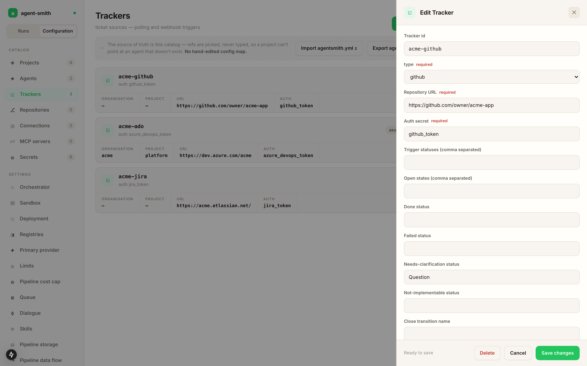
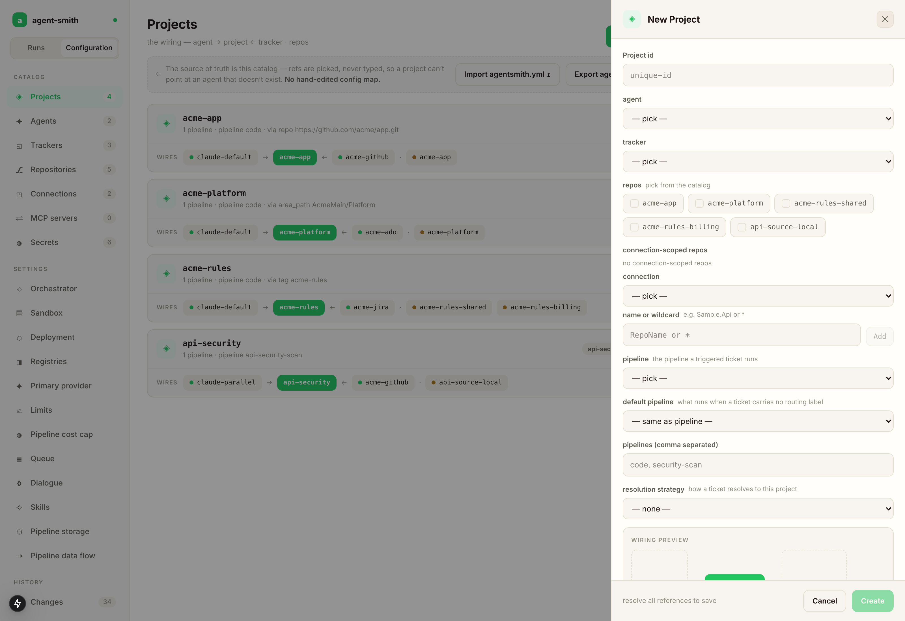

# Tracker: Azure DevOps Boards

Use this when your tickets live in Azure DevOps work items and your repos are in Azure DevOps Git. The example here is the fictional `TodoList` product in the `Platform` project on `acme-org`.

## What you're wiring

Five things, in this order, because each one references the one before it:

1. **Secrets**, the env var names for your Azure DevOps PAT and your AI provider key.
2. **An agent**, which LLM and which model per role.
3. **Repositories**, the Azure DevOps Git repos the pipelines clone and push to.
4. **A tracker**, the (organization, project) pair whose work items you read and write back.
5. **A project**, the wiring: this agent, this tracker, these repos, and how a work item routes here.

## In the studio

Open the dashboard, switch the rail to **Configuration**, and work down the catalogs.

**Secrets.** New secret, name it `azure_devops_token`. You're registering the *name*. The value stays in the environment of the server process (or your k8s Secret), and the studio never sees it. Do the same for your provider key.

**Agents.** New agent, id `azure-openai-default`, provider `azure_openai`. Fill the endpoint and api version, pick the key secret from the dropdown, then set a model per role: a cheap one for `scout`, the good one for `primary` and `coding`. If you want dollar figures on your runs rather than just token counts, add the pricing section while you're in there.

**Repositories.** One entry per repo: the clone URL, and `azure_devops_token` as the auth. If you'd rather not list them one by one, add a **Connection** instead (organization plus project plus auth), and a project can then pull repos from that scope by name or wildcard rule.

**Trackers.** New tracker, type `azure_devops`. The form switches to the Azure fields once you pick the type: organization, project, URL, auth secret. Then the workflow, which the tracker owns for every project routed to it:

- **Open states**, the work item states Agent Smith treats as eligible. Anything else is ignored.
- **Done status**, where a finished run moves the ticket.
- **Failed status**, where a failed run parks it. Leave it empty and the status stays put.
- **Needs-clarification status**, where a ticket goes when the agent has questions it won't guess at.
- **Pipeline by label** and **Default pipeline**, which label runs which pipeline, and what a work item runs when no label matched. Both are picked from the pipelines that exist.
- **Work item kind by filing role**, which work-item type a ticket Agent Smith files is created as (see below).



**Projects.** New project. Pick the agent and the tracker on the identity tab, the repos on the repos tab, and set the resolution strategy on the routing tab. For Azure DevOps that's `tag`, `area_path`, or `repo`. Tag is the common one: tag a work item `TodoList` and it routes to this project. **Create** stays disabled until every reference resolves, and once saved, the project card expands into a graph of what you've wired.



That's the whole wiring. Two environment variables and Agent Smith can claim a work item and open a pull request end to end.

## The same thing as YAML

The CLI reads this shape directly, and a server takes it through `agent-smith config import`. It's also what **Export agentsmith.yml** gives you back.

<details>
<summary>The full config for the example above</summary>

```yaml
# yaml-language-server: $schema=https://raw.githubusercontent.com/holgerleichsenring/agent-smith/main/config/agentsmith.schema.json

deployment:
  registry: holgerleichsenring
  version: 0.108.0

agents:
  azure-openai-default:
    type: azure_openai
    endpoint: https://oai-acme-dev.openai.azure.com
    api_version: 2025-01-01-preview
    cache:
      is_enabled: true
      strategy: automatic
    retry:
      max_retries: 5
      initial_delay_ms: 4000
      backoff_multiplier: 2.0
      max_delay_ms: 60000
    models:
      scout:   { model: gpt-4.1-mini, deployment: gpt-4o-mini-deployment, max_tokens: 4096 }
      primary: { model: gpt-4.1,      deployment: gpt4-1-deployment,     max_tokens: 8192 }
      planning:      { model: gpt-4.1,      deployment: gpt4-1-deployment,     max_tokens: 4096 }
      summarization: { model: gpt-4.1-mini, deployment: gpt-4o-mini-deployment, max_tokens: 2048 }

repos:
  todolist-api:
    type: azure_devops
    url: https://dev.azure.com/acme-org/Platform/_git/TodoList.Api
    auth: azure_devops_token
  todolist-worker:
    type: azure_devops
    url: https://dev.azure.com/acme-org/Platform/_git/TodoList.Worker
    auth: azure_devops_token
  todolist-web:
    type: azure_devops
    url: https://dev.azure.com/acme-org/Platform/_git/TodoList.Web
    auth: azure_devops_token
  todolist-docs:
    type: azure_devops
    url: https://dev.azure.com/acme-org/Platform/_git/TodoList.Docs
    auth: azure_devops_token

trackers:
  acme-platform:
    type: azure_devops
    url: https://dev.azure.com/acme-org
    organization: acme-org
    project: Platform
    auth: azure_devops_token
    open_states:  [New, Active]
    done_status:  Resolved
    needs_clarification_status: Blocked
    work_item_kinds:
      work: User Story     # an approved cut's one work ticket
      phase: User Story    # a single phase filed from a design conversation
      bug: Bug
      chat: Task           # "create a ticket" from chat
    polling:
      enabled: true
      interval_seconds: 60
      jitter_percent: 10

projects:
  azuredevops-todolist:
    agent: azure-openai-default
    tracker: acme-platform
    repos:
      - todolist-api
      - todolist-worker
      - todolist-web
      - todolist-docs
    azuredevops_trigger:
      project_resolution:
        strategy: tag
        value: TodoList
      trigger_statuses: [New, Active]
      done_status: Resolved
      pipeline_from_label:
        agent-smith:bug:                code
        agent-smith:feature:            code
        agent-smith:security-scan:      security-scan
        agent-smith:api-security-scan:  api-security-scan

secrets:
  azure_openai_api_key: ${AZURE_OPENAI_API_KEY}
  azure_devops_token:   ${AZURE_DEVOPS_TOKEN}
```

</details>

Because the tracker carries the workflow, a project routed to it only has to declare how tickets match it:

```yaml
projects:
  azuredevops-todolist:
    agent: azure-openai-default
    tracker: acme-platform
    repos: [todolist-api, todolist-worker, todolist-web, todolist-docs]
    resolution:
      tag: TodoList                    # or: area_path: AcmeMain/Platform
```

The explicit `azuredevops_trigger:` block works too and overrides the tracker field by field. Reach for it when one project needs its own `comment_keyword` or a different label map.

`work_item_kinds` maps the roles Agent Smith files tickets under to your process's work-item types: `work` (the one work ticket an approved cut files), `phase` (a single phase filed from a design conversation), `bug` and `chat` (a ticket a chat request asked for). A role you don't map keeps the type it would have had anyway, and the filing states which type it used. Whatever type you pick, its workflow has to contain your lifecycle statuses (`done_status`, `failed_status`, `needs_clarification_status`); a work item whose type doesn't know them can't be moved, and the refusal names the type as the usual cause.

## Authentication

Generate a Personal Access Token in Azure DevOps with these scopes:

- **Code** — Read & Write (clone, push, open PRs).
- **Work Items** — Read & Write (read tickets, update status, add comments, add/remove labels).

Set it in the environment:

```bash
export AZURE_DEVOPS_TOKEN=...
```

The tracker, the connections and the repos read it through the secret their `auth` names (`azure_devops_token: ${AZURE_DEVOPS_TOKEN}`), for API calls and for clone and push alike, so a second organization gets a secret and a variable of its own.

The token rotates whenever you rotate it in Azure DevOps. Agent Smith reads it once at startup, so restart the orchestrator after a rotation. The studio holds the *name* of the secret, so there's nothing to change there.

## How tickets reach Agent Smith

Three ways, pick one:

- **Webhook** (preferred). Azure DevOps posts to Agent Smith on work-item updates. The server listens on port 8081; point the service hook at `POST /webhook` (Azure DevOps sends no platform header, so the platform is recognised from the payload's `publisherId` and `eventType` — on `/webhook` only). Verification is a Basic-auth header checked against the `AZDO_WEBHOOK_SECRET` environment variable on the server process — there is no secret key in the config. Set up in [Webhooks: Azure DevOps](../trigger-it/webhooks.md#azure-devops). Leave polling off on the tracker.
- **Polling**. Agent Smith asks the tracker every `interval_seconds` what's new. Use this when you can't set up a webhook (NAT, on-prem tracker, fast iteration). Turn it on in the tracker's polling section and set the interval there; the running server picks the change up without a restart.
- **Manual CLI**. `agent-smith code --ticket 54 --project azuredevops-todolist` — explicit, useful for testing the config. See [Trigger from CLI](../trigger-it/cli.md).

## What gets written back to the ticket

The database is the system of record; the work-item status and labels are a best-effort projection of it.

When a run finishes:

- Status transitions to `done_status` (in the example, `Resolved`).
- A new comment with the PR URLs and the run id (e.g. `2026-05-22T14-03-11-9f2a`).
- The `agent-smith:done` label gets added; `agent-smith:in-progress` removed.
- PRs whose verification came back red are opened as **drafts**, so nothing unreviewed looks mergeable.

When a run fails:

- Status moves to `failed_status` if configured; otherwise it stays where it is.
- The `agent-smith:failed` label gets added.
- A new comment with the failed-step name and the error message.

The run lifecycle is carried as `agent-smith:*` tags. A board with its own vocabulary can rename them with a `label_names:` map on the tracker (keys `pending`, `enqueued`, `in-progress`, `done`, `failed`, `waiting`, `shortfall`, `approved-set`); tags written under an older name are still recognised.

When a ticket is too thin to act on (title-only, or the run needs a decision), Agent Smith doesn't guess: it posts its open questions as a work-item comment and parks the ticket in `needs_clarification_status` (settable on the tracker or the project). Without one, a project whose pipeline can park gets a blocking startup finding and its trigger stays off until you set it. Answering the questions resumes the run — see [Spec dialogue](../how-it-works/spec-dialogue.md).

## Next

- [Repos: multi-repo](repos-multi.md) — wire all four TodoList repos as one project (the config above is already multi-repo; the page explains the model).
- [Webhooks: Azure DevOps](../trigger-it/webhooks.md#azure-devops) — the URL shape, the payload, secret verification.
- [AI providers](ai-providers.md) — if you want Claude or local Ollama instead of Azure OpenAI.
- [Host it](../host-it/docker-compose.md) — moving from a CLI smoke test to a real deployment.
