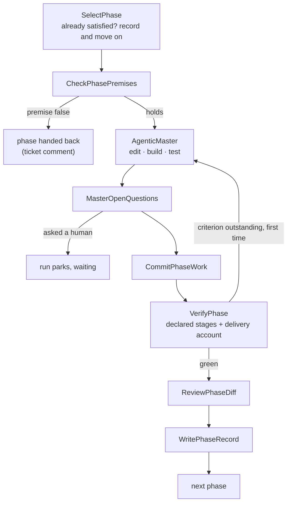

# Lifecycle

What happens between "ticket lands in the tracker" and "ticket gets set back to resolved with PR links". The diagram first, then the prose.



## In seven steps

**1. The ticket comes in.** Webhook from your tracker, or a poll round picks it up, or a CLI invocation explicitly names it. The framework parses the payload and claims the ticket — the claim is a database lease, so a webhook+poll race can't double-trigger and one ticket has at most one live run, by construction. If the run's footprint doesn't fit right now it queues FIFO instead of failing ([capacity](../reference/operations/capacity.md)).

**2. The run reads before it provisions.** `FetchTicket` pulls the whole ticket — body, comment thread, image and document attachments. `ScopeRepos` then makes one cheap model call that does three things. It narrows the run to the repos the ticket actually touches, before a single sandbox exists, so a five-repo project doesn't pay for five build boxes on a one-repo fix. It estimates the ticket's size, which sizes the run's cost budget. And it is the run's security check: a ticket that asks for something that must not be done is refused right there, parked in your `needs_clarification_status` with the offending sentence quoted, before anything is checked out. If the master later finds it needs another repo after all, it can escalate mid-run (`ensure_repo_sandbox`).

**3. Sandboxes spawn, repos get cloned.** One sandbox per affected repo, each running the toolchain image the repo's stack calls for (declared in its `.agentsmith/` context, or pinned per language in config). The sandbox-agent binary is injected via an init-container that copies it into a shared `emptyDir`; the toolchain image itself stays unmodified. Every repo gets the work branch `agent-smith/<ticket-id>`. `RunPreflight` then proves what can be proven in seconds: the agent configuration is real, every sandbox home accepts a write, declared credentials arrived. A failed check stops the run and names the fix; a branch that already carries earlier work, or a registry with no secret, is reported but not refused. Private-registry credentials get pre-staged (`SetupRegistryAuth`), and `BootstrapGate` stops the run if a repo was never initialized.

**4. The ticket becomes a specification.** After `AnalyzeCode` has read the code, `DeriveSpec` cuts the ticket into an ordered set of phase specs — each with a goal, its steps and a "done when" list — and commits them to the ticket branch under `.agentsmith/specs/<provider>-<ticket-id>/`. The spec is the plan; there is no separate planning or approval step. The cut is posted to the ticket as "this is how I understood the ticket" and the run carries on without waiting. The draft pull request opens here, at the spec commit, so you can read the cut while the work is running. When the ticket reads two ways, contradicts the repository, or cannot be built as written, the run hands it back instead of guessing — see [the code pipeline](../reference/pipelines/fix-and-feature.md#when-the-ticket-comes-back-to-you). A ticket filed from a specification approved in [Work it out](work-it-out.md) or the [spec dialogue](spec-dialogue.md) skips the derivation and works the set that is already on its branch.

**5. The master works one phase at a time.** For each phase in order: a fresh instance checks the premises the phase states against the code as it is now, then one agentic loop (`coding-agent-master`) does the work. One conversation, N sandboxes routed by path prefix — file tool calls dispatch by the first path segment (`todolist-api/src/Auth.cs` → the `todolist-api` sandbox). The master edits, builds and runs the repo's own tests itself; every command is visible in the run's timeline. Its work is committed to the branch as it goes.

**6. Each phase is verified before the next one starts.** `VerifyPhase` runs the verify stages each repository declares in its context (build, test, lint, whatever you wrote down), then takes the [delivery account](delivery-account.md): every "done when" criterion, checked against the real branch by a reader that never saw the agent's reasoning. An outstanding criterion goes back to the master for one repair pass. After that, a fresh reviewer reads the phase's diff against the spec and the repository's principles; its findings get one fix pass, and a fix that doesn't verify is undone. Only then does the next phase start.

**7. The PRs are finalized, the ticket gets resolved.** One PR per repo with changes, cross-linked to each other. Before anything is pushed, the staged diff is scanned for known secret patterns — a leaked key refuses the commit. The PR body carries the per-phase table, the delivery account, the review findings and any criteria the agent declined. A complete, verified run takes the PR out of draft. The ticket transitions to `done_status`, gets a comment with the PR URLs, and gets the `agent-smith:done` label.

## The loop inside a phase



A phase whose criteria the branch already satisfies when it is entered is recorded as "already satisfied by the branch on entry" and skipped — no master pass, no question. That's what makes a re-run on a half-finished branch cheap.

The binding fence around the master is a per-ticket money-and-token budget sized from the scope estimate, not an iteration count. The master keeps going while it makes forward progress and stops when its work is done, its budget is gone, or it needs a person.

## When it goes wrong

A run always finalizes — success, shortfall, failure, timeout, cancel — and `result.md` leads with the why.

**Failure.** A step failed and no phase was verified. The work is still pushed: the draft PR is opened or refreshed with a "Run failed" banner naming the reason, and it never says the run completed. The ticket gets the `agent-smith:failed` label, your configured `failed_status` if set, and a comment with the failing step and the error message.

**Shortfall.** The run stopped after at least one phase had verified — a later phase went red, ran out of budget, or was handed back. Each sandbox is reset to its last verified commit, so work the stopped phase had begun is not shipped. The verified phases go out on a ready PR, whose body and ticket comment carry a "Not delivered" section naming every phase that was left and why. The run's status is `shortfall`, the ticket moves to your done status and carries `agent-smith:shortfall`. You decide whether to merge what's there or send it back.

**A phase handed back.** When the premise check finds that a phase rests on something that is no longer true, the phase is not built. The ticket gets a comment saying which premise failed and what was looked at; the specification is never rewritten by the run. You correct an unstarted phase on the ticket branch under `.agentsmith/specs/`, and the next run works your edit.

**A question.** When the master needs a person, the run parks: the question goes on the ticket (mentioning the assignee, or saying nobody could be notified), the ticket moves to your `needs_clarification_status` and gets `agent-smith:waiting`, and the run releases its compute. Answer it in the dashboard, or on Azure DevOps with a comment on the ticket, and the same run picks up from the question. On the other trackers, reply on the ticket and move it back to a trigger status; the next run reads your reply. See [durable dialogue](expectations.md#durable-dialogue-checkpoint-at-the-ask-resume-on-the-answer).

Mid-run, the master's work is committed and pushed to the branch every time it marks progress, at most every `agent.checkpoint_push_min_interval_seconds` (default 120). A crashed sandbox or a killed pod loses at most the work since the last checkpoint. Each checkpoint passes the same secret scan as the final commit.

Run liveness is derived from the orchestrator itself (does the run's pod/container actually exist), not from a heartbeat key that a busy process might miss. The database knows what was in flight; a server restart reconciles instead of duplicating. Analysis stays fresh the same way — the project-map cache is keyed on the repo's HEAD SHA, so a new commit re-analyzes instead of reasoning about last week's code.

## Per-repo bootstrap

When a repo in scope hasn't been bootstrapped yet, `BootstrapGate` stops the run and names the repos that are missing their `.agentsmith/` files, followed by "Run init-project first." The `init-project` pipeline iterates the project's repos, writes a context and a `principles.md` into each, opens one bootstrap PR per repo, and cross-links them. Run it once per project (it handles all the repos in one go). What goes into a context is on [the context file](../reference/concepts/context-file.md).

## Run identifiers

Every run gets an id of the shape `{yyyy-MM-ddTHH-mm-ss}-{4hex}`: an ISO-8601 timestamp in UTC plus a 4-hex random suffix, which kills same-second collisions when a batch of tickets all queue at once. Lexicographically sortable in `ls`. The run's record directory is named after the id alone.

```
.agentsmith/runs/
├── 2026-05-22T14-03-11-9f2a/
├── 2026-05-22T14-29-44-4c19/
└── 2026-05-22T15-04-02-b7d1/
```

## Next

- [Methodology](methodology.md) — why derive / check / execute / verify are ordered the way they are.
- [The delivery account](delivery-account.md) — how "done" is decided per criterion.
- [Expectations & durable dialogue](expectations.md) — the done-list, declined criteria, and waiting for your answer.
- [Multi-repo](multi-repo.md) — the path-prefix dispatch model, deeper.
- [Skills catalog](skills-catalog.md) — what the master and its sub-agents are built from.
