# Multi-repo

Most products I've worked on span two or three repos. A "fix the auth flow" ticket touches the API, the client, and probably the worker that handles refresh tokens. That's why Agent Smith does one ticket → one run → N pull requests instead of one ticket per repo.



## What "multi-repo" looks like in config

One entry under `projects:` with more than one repo in its `repos:` list. See [Repos: multi-repo](../connect-your-stuff/repos-multi.md) for the worked TodoList example.

## What the framework does

**One ClaimRequest per ticket.** The enqueue layer doesn't fan out per-repo. Multi-repo projects produce exactly one entry on the Redis job queue per ticket. See [Ticket lifecycle](../reference/concepts/ticket-lifecycle.md) for the claim machinery.

**N sandboxes, eager.** `PipelineSandboxCoordinator.EnsureSandboxesAsync` creates all the sandboxes before the first sandbox-requiring command runs. Predictable timing beats lazy per-repo creation; the cost (an alpine sandbox for a docs repo that the bug-fix doesn't end up touching) is small.

**Path-prefix routing.** The agent's tool surface looks like one filesystem partitioned by repo:

```
todolist-api/src/Auth.cs            → Sandboxes["todolist-api"]   reads /work/src/Auth.cs
todolist-web/src/auth/login.ts      → Sandboxes["todolist-web"]   reads /work/src/auth/login.ts
todolist-docs/auth.md               → Sandboxes["todolist-docs"]  reads /work/auth.md
```

The first segment of every file path is the catalog key from `repos:`. Unknown prefix throws with the known-repos list. The `run_command` tool requires an explicit `repo` argument on multi-repo runs — paths inside a shell command don't carry a prefix the framework can parse.

**One agent conversation, not N.** The orchestrator holds one plan across all repos and one agent conversation. The system prompt names the repos in scope. The agent decides where to make changes based on the plan.

**Per-repo bootstrap.** Each repo gets its own `.agentsmith/context.yaml` (toolchain image, project language) and `.agentsmith/coding-principles.md` (project-specific rules). The handlers iterate per repo via `ContextKeys.Sandboxes` + `ContextKeys.Repos`. The `init-project` pipeline writes these files per repo and opens one bootstrap PR per repo, cross-linked.

**One PR per repo, cross-linked.** `CommitAndPRHandler` iterates the per-repo `Configs` list. Each PR body carries a `<!-- agentsmith:sibling-prs -->` marker. After every PR has been opened, `PrCrossLinkHandler` PATCHes each PR body and inserts links to the siblings:

```
<!-- agentsmith:sibling-prs -->
Sibling pull requests:
- todolist-api    https://dev.azure.com/.../pullrequest/4471
- todolist-worker https://dev.azure.com/.../pullrequest/4472
- todolist-web    https://dev.azure.com/.../pullrequest/4473
- todolist-docs   (no changes — skipped)
```

**Branch coherence.** Every repo's branch is named `agentsmith/ticket-{N}`. Reviewers see the same branch name on every sibling PR.

## Single-repo as the N=1 case

Single-repo projects use the same code paths. `Sandboxes` is a dict with one entry. The path-prefix router short-circuits (one entry → pass through). `PrCrossLinkHandler` is a no-op when fewer than 2 PRs were opened. No special-casing.

This was deliberate. Earlier versions had a split: a single-repo code path and a multi-repo code path that drifted apart. The unification in p0158a–g (one ticket = one run = 1..N PRs) ended that divergence. The trade-off is the workdir layout moved from `/work/` to `/work/{repo-key}/` even for single-repo projects — documented breaking change at the time.

## Mixed toolchains across repos

When the repos in a project use different languages, each sandbox gets its own image. The `.agentsmith/context.yaml` per repo declares the language:

```yaml
# In todolist-api repo
project_language: csharp
# In todolist-web repo
project_language: typescript
# In todolist-worker repo
project_language: python
```

`SandboxSpecBuilder` maps each language to an image (via its layered chain — operator override per-repo, then per-language defaults). The framework runs the `dotnet test` step inside the .NET sandbox and `npm test` inside the Node sandbox, in parallel. Test failure aggregation is logical-AND: if any repo's tests fail, the run fails.

## CLI ergonomics

To scope a CLI run to one repo of a multi-repo project:

```bash
agent-smith fix --ticket 54 --project azuredevops-todolist --repo todolist-api
```

Useful for testing the per-repo bootstrap before turning on the full multi-repo flow, or when you know a ticket only needs changes in one repo.

## See also

- [Repos: multi-repo](../connect-your-stuff/repos-multi.md) — the configuration walk-through.
- [Methodology](methodology.md) — what plan / review / verify do across repos.
- [Lifecycle](lifecycle.md) — the full ticket-in to ticket-back flow.
