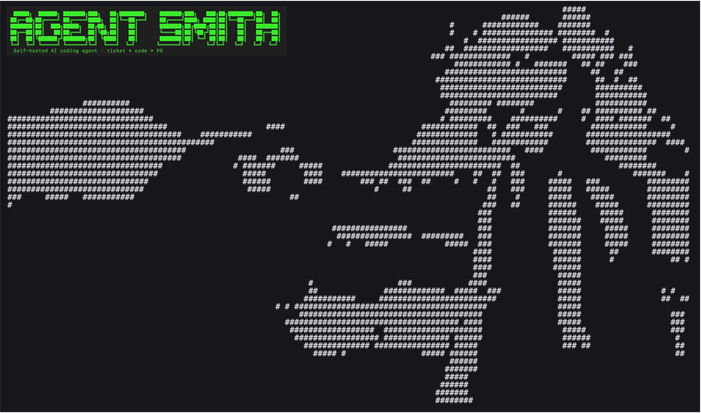

Open-source framework for AI-powered workflows. Define pipelines as chains of steps — each can spawn sub-agents, run multi-role discussions, call tools, or move files around. Orchestration, tool calling, cost tracking, and delivery included.

Everything runs on your infrastructure. Your API keys. Your data. No SaaS in between.

---

## What It Does

```
You:           "fix #54 in todo-list"
               ↓
 [1/13] FetchTicket          → Reads ticket from Azure DevOps / GitHub / Jira / GitLab
 [2/13] CheckoutSource       → Clones repo, creates branch fix/54
 [3/13] BootstrapProject     → Detects language, framework, project type
 [4/13] LoadCodeMap          → Generates navigable code map
 [5/13] LoadCodingPrinciples      → Loads your coding standards & domain rules
 [6/13] LoadContext          → Loads project context (.agentsmith/context.yaml)
 [7/13] AnalyzeCode          → Scout agent maps the codebase, identifies relevant files
 [8/13] GeneratePlan         → AI generates a step-by-step implementation plan
 [9/13] Approval             → Shows plan, waits for your OK (or runs headless)
[10/13] AgenticExecute       → AI agent writes the code, iterating with tools
[11/13] Test                 → Runs your test suite
[12/13] WriteRunResult       → Writes run result with token usage & cost data
[13/13] CommitAndPR          → Commits, pushes, opens PR, closes ticket
               ↓
Agent Smith:   "Pull request created: https://github.com/.../pull/42"
```

That's the standard bug fix pipeline. There are [seven more](pipelines/index.md).

---

## Quick Links

| | |
|---|---|
| **[Installation](getting-started/installation.md)** — Binary, Docker, or source | **[First Bug Fix](getting-started/first-bug-fix.md)** — From ticket to PR in 5 minutes |
| **[API Security Scan](getting-started/first-api-scan.md)** — Scan a live API | **[Pipelines](pipelines/index.md)** — All seven pipeline presets |
| **[Configuration](configuration/agentsmith-yml.md)** — agentsmith.yml reference | **[AI Providers](providers/index.md)** — Claude, GPT-4, Gemini, Ollama, Groq |
| **[CI/CD Integration](cicd/index.md)** — Azure DevOps, GitHub Actions, GitLab | **[Architecture](architecture/index.md)** — Clean Architecture deep-dive |

---

## Pipelines at a Glance

| Pipeline | What it does | Steps |
|----------|-------------|-------|
| **fix-bug** | Ticket → branch → code → test → PR | 13 |
| **add-feature** | Same + generates tests and docs | 14 |
| **security-scan** | Multi-role code security review | 11 |
| **api-scan** | Nuclei + Spectral + AI panel on live API | 8-11 |
| **legal-analysis** | Contract review with 5 legal specialists | 8 |
| **mad-discussion** | Multi-agent design discussion | 7 |
| **init-project** | Bootstrap .agentsmith/ directory | 3 |

---

## License

MIT License. Copyright (c) 2026 Holger Leichsenring.

---

**[CodingSoul Blog](https://codingsoul.org)** — Behind-the-scenes posts about building Agent Smith · **[Community Forum](https://agent-smith.org)** — Discuss, ask questions, share your setups
