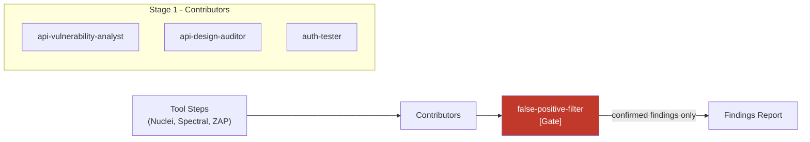

# API Scan

The **api-security-scan** pipeline scans a running API against its OpenAPI spec. It combines automated scanner tools (Nuclei, Spectral) running in Docker containers with an AI specialist panel that interprets, contextualizes, and filters the results.

!!! info "Pipeline type: structured"
    Since Phase 64, api-security-scan uses the **structured** pipeline type. `SkillGraphBuilder` builds a deterministic execution graph from skill metadata -- no LLM triage, no convergence rounds. Skills run in staged order with typed JSON handoffs between stages.

## Pipeline Steps

| # | Command | What It Does |
|---|---------|-------------|
| 1 | LoadSwagger | Loads and parses the swagger.json / OpenAPI spec |
| 2 | SpawnNuclei | Runs Nuclei vulnerability scanner in a Docker container |
| 3 | SpawnSpectral | Runs Spectral OWASP linter in a Docker container |
| 4 | SpawnZap | Runs OWASP ZAP DAST scan against the target (skips if `dast.enabled: false`) |
| 5 | LoadSkills | Loads API security skill definitions from YAML |
| 6 | ApiSecurityTriage | Builds deterministic skill graph via `SkillGraphBuilder` (no LLM) |
| 7 | SkillRounds | Runs skills in staged order: contributors (parallel) then gate then executor |
| 8 | CompileFindings | Consolidates typed findings into a structured report |
| 9 | DeliverFindings | Writes output in the requested format(s) |

## Automated Scanners

### Nuclei (Vulnerability Scanner)

[Nuclei](https://github.com/projectdiscovery/nuclei) runs inside a Docker container via `DockerToolRunner`. It probes the live API target for known vulnerabilities using its template library.

```
SpawnNucleiHandler
  → writes swagger.json to a temp file
  → launches Docker container: projectdiscovery/nuclei
  → scans the --target URL with API-focused templates
  → parses JSON output into NucleiResult (findings with severity, URL, template ID)
  → stores result in PipelineContext
```

Findings are categorized by severity (critical, high, medium, low) and passed to the AI specialist panel for interpretation.

### Spectral (OWASP Linter)

[Spectral](https://github.com/stoplightio/spectral) runs inside a separate Docker container. It lints the OpenAPI spec against OWASP API security rules — catching design-level issues that no runtime scanner can find.

```
SpawnSpectralHandler
  → writes swagger.json to a temp file
  → launches Docker container: stoplight/spectral
  → lints against OWASP API security ruleset
  → parses output into SpectralResult (findings with error/warning severity)
  → stores result in PipelineContext
```

!!! note "Docker required"
    Both Nuclei and Spectral run as Docker containers. Ensure Docker is available on the machine running Agent Smith. The containers are pulled automatically on first use.

## The Specialist Panel (4 Roles)

After the automated scanners complete, the AI specialist panel reviews and interprets the combined results. Each role is defined in `config/skills/api-security/`.

| Role | Emoji | Focus Area |
|------|-------|------------|
| **API Vulnerability Analyst** | 🔍 | Lead role. Maps Nuclei findings to OWASP API Security Top 10 (2023). Assesses exploitability and impact. |
| **API Design Auditor** | 📐 | Deep schema analysis — sensitive data in responses, enum opacity, REST semantic violations, missing constraints, Spectral findings interpretation |
| **Auth Tester** | 🔐 | JWT validation, OAuth flow security (PKCE, state), API key handling, missing auth on state-mutating endpoints, Bearer vs Cookie mixing |
| **False Positive Filter** | 🧹 | Nuclei-specific false positive filtering. Removes low-confidence findings, template artifacts, and duplicates. |

### How Skills Collaborate

API scan uses the **structured pipeline** pattern. For a general overview of all pipeline orchestration patterns, see [Multi-Agent Orchestration](../concepts/multi-agent-orchestration.md).



Stage 1 contributors run in parallel, each receiving scanner output relevant to their expertise. The gate filters low-confidence findings and Nuclei template artifacts.

### Deterministic Skill Graph

Since Phase 64, the `ApiSecurityTriage` step uses `SkillGraphBuilder` to construct a deterministic execution graph from skill metadata (`runs_after`/`runs_before` declarations). There is no LLM call during triage. Skills are topologically sorted into execution stages:

1. **Stage 1 -- Contributors** (parallel): API Design Auditor, Auth Tester, and API Vulnerability Analyst each analyze their respective findings in a single call with typed JSON output.
2. **Stage 2 -- Gate**: The False Positive Filter reviews all contributor output and produces a typed `List<Finding>`, vetoing low-confidence results.

Each skill runs exactly once. ConvergenceCheck is skipped for structured pipelines.

The swagger spec and scanner signals are still used to populate context for each skill, but skill *selection* is determined by the graph, not by LLM analysis:

- **ID-based paths** (BOLA risk): `/api/users/{id}`, `/api/orders/{orderId}`
- **Auth scheme declared**: Bearer, OAuth2, API key
- **Unprotected endpoints**: state-mutating routes with no security requirement
- **Query parameters**: potential injection vectors
- **Bulk operation endpoints**: `/api/users/batch`, `/api/export`

### OWASP API Security Top 10 (2023) Mapping

The API Vulnerability Analyst maps every valid finding to the most specific OWASP category:

| Category | Description |
|----------|-------------|
| API1:2023 | Broken Object Level Authorization (BOLA) |
| API2:2023 | Broken Authentication |
| API3:2023 | Broken Object Property Level Authorization |
| API4:2023 | Unrestricted Resource Consumption |
| API5:2023 | Broken Function Level Authorization |
| API6:2023 | Unrestricted Access to Sensitive Business Flows |
| API7:2023 | Server Side Request Forgery (SSRF) |
| API8:2023 | Security Misconfiguration |
| API9:2023 | Improper Inventory Management |
| API10:2023 | Unsafe Consumption of APIs |

## Output Formats

The `--output` flag accepts comma-separated values:

| Format | Flag | Description |
|--------|------|-------------|
| Console | `console` | Findings printed to stdout (default) |
| Summary | `summary` | Condensed one-line-per-finding output |
| Markdown | `markdown` | Full report written to `--output-dir` |
| SARIF | `sarif` | Machine-readable SARIF 2.1.0 written to `--output-dir` |

```bash
# Multiple formats at once
agent-smith api-scan \
  --swagger https://api.example.com/swagger.json \
  --target https://api.example.com \
  --output console,sarif,markdown \
  --output-dir ./reports
```

Output directory resolution order:

1. `--output-dir` (if specified)
2. `/output` (Docker container mount)
3. `./agentsmith-output` (local fallback)
4. System temp directory (last resort)

## Tool Configuration

### nuclei.yaml

Nuclei behavior can be customized in your project's tool configuration:

```yaml
tools:
  nuclei:
    image: projectdiscovery/nuclei:latest
    templates:
      - api
      - cves
      - exposures
    severity_threshold: medium
    timeout: 300
```

### spectral.yaml

Spectral uses the OWASP API security ruleset by default:

```yaml
tools:
  spectral:
    image: stoplight/spectral:latest
    ruleset: spectral:oas
    fail_severity: warn
```

## CLI Examples

```bash
# Scan a running API
agent-smith api-scan \
  --swagger ./swagger.json \
  --target https://api.staging.example.com

# Scan with a remote swagger URL
agent-smith api-scan \
  --swagger https://api.example.com/swagger/v1/swagger.json \
  --target https://api.example.com

# SARIF output for CI integration
agent-smith api-scan \
  --swagger ./swagger.json \
  --target https://localhost:5001 \
  --output sarif \
  --output-dir ./test-results

# Dry run — show the pipeline without executing
agent-smith api-scan \
  --swagger ./swagger.json \
  --target https://api.example.com \
  --dry-run
```

!!! warning "Live API required"
    Nuclei scans a **live, running API**. The `--target` URL must be reachable. Use a staging environment, never production, for automated scanning.

## Example Output

A typical scan of a REST API with 30 endpoints might produce:

```
Nuclei: 12 findings (0C/2H/5M) in 45s
Spectral: 18 findings (4E/14W) in 3s

API Vulnerability Analyst: 8 findings mapped to OWASP categories
API Design Auditor: 6 schema-level findings
Auth Tester: 3 auth findings (missing PKCE, JWT without audience)
False Positive Filter: Retained 14 of 17 findings (3 filtered)

Final report: 14 findings (2 HIGH, 7 MEDIUM, 5 LOW)
```
