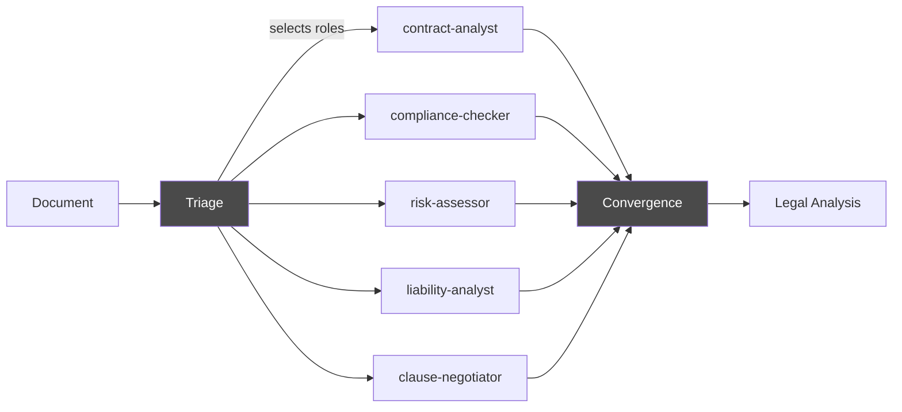

# Legal Analysis

The **legal-analysis** pipeline reviews contracts and legal documents using a panel of 5 specialist roles. It reads documents from an inbox folder, converts them to Markdown, runs a multi-role analysis, and delivers the output to an outbox folder. All legal output is written in **German legal language**.

## Pipeline Steps

| # | Command | What It Does |
|---|---------|-------------|
| 1 | AcquireSource | Picks up a document from the inbox folder, creates a workspace |
| 2 | BootstrapDocument | Converts to Markdown via MarkItDown, detects contract type, loads legal skills |
| 3 | LoadDomainRules | Loads `legal-principles.md` with analysis guidelines |
| 4 | Triage | AI selects which legal specialist roles should participate |
| 5 | ConvergenceCheck | Evaluates if all roles agree; re-runs objecting roles if not |
| 6 | CompileDiscussion | Consolidates all role analyses into a final document |
| 7 | DeliverOutput | Writes analysis to outbox, archives source document |

## Inbox / Outbox Folder Watching

The legal pipeline uses a file-based workflow:

```
legal-docs/
├── inbox/          ← drop contracts here (PDF, DOCX, etc.)
├── processing/     ← file moves here during analysis
├── outbox/         ← analysis results appear here
└── archive/        ← original + result after completion
```

**AcquireSource** picks up the file, copies it to a temp workspace, and sets up the pipeline context. **DeliverOutput** writes the compiled analysis to `outbox/` as a timestamped Markdown file and moves the original to `archive/`.

```
inbox/vertrag-lieferant-xyz.pdf
  → processing (during analysis)
  → outbox/20260325-143022-vertrag-lieferant-xyz-analysis.md
  → archive/20260325-143022-vertrag-lieferant-xyz.pdf
```

## Document Conversion

The `BootstrapDocument` step converts the input document to Markdown using [MarkItDown](https://github.com/microsoft/markitdown). Supported formats:

- PDF
- DOCX / DOC
- XLSX
- PPTX
- HTML

After conversion, the handler uses an LLM call to classify the contract type:

| Contract Type | German Name | Triggers |
|---------------|-------------|----------|
| `nda` | Geheimhaltungsvereinbarung | Non-disclosure agreements |
| `werkvertrag` | Werkvertrag | Work contracts (deliverable-based) |
| `dienstleistungsvertrag` | Dienstleistungsvertrag | Service contracts (effort-based) |
| `saas-agb` | SaaS-AGB | SaaS terms of service |
| `kaufvertrag` | Kaufvertrag | Purchase contracts |
| `mietvertrag` | Mietvertrag | Lease contracts |
| `unknown` | Unbekannt | Fallback for unrecognized types |

The detected type determines which specialist roles are activated via their trigger lists.

## The 5 Legal Specialist Roles

Each role is defined in `config/skills/legal/` and writes its analysis in German.

### 📄 Contract Analyst

**File:** `contract-analyst.yaml`

Reads the contract systematically from top to bottom. Identifies every clause, its purpose, and what it obliges each party to do. Flags unusual, missing, or ambiguous clauses.

Output structure per clause:

```markdown
## Vertraulichkeitspflicht (§ 3)
**Zweck:** Schutz vertraulicher Informationen beider Parteien
**Pflichten:** Auftragnehmer: Geheimhaltung / Auftraggeber: Kennzeichnung
**Anmerkung:** Standard — keine Auffaelligkeiten
```

### 🔐 Compliance Checker

**File:** `compliance-checker.yaml`

Checks for DSGVO (GDPR) compliance and validity under German AGB-Recht (standard form contract law, sections 305-310 BGB). Evaluates:

- Auftragsverarbeitungsvertrag (data processing agreement) references
- Data categories, purpose, and retention periods
- Prohibited clauses under sections 308 and 309 BGB
- Surprising clauses under section 305c BGB
- Proper AGB incorporation under section 305 BGB

### ⚠️ Risk Assessor

**File:** `risk-assessor.yaml`

Evaluates each clause for risk from the client's perspective. Assigns risk levels and flags missing clauses that are typically expected for the contract type.

| Risk Level | Meaning |
|------------|---------|
| 🔴 HIGH | Could cause significant financial or legal harm |
| 🟡 MEDIUM | Worth negotiating or clarifying |
| 🟢 LOW | Standard, no action needed |

### ⚖️ Liability Analyst

**File:** `liability-analyst.yaml`

Deep-dives into liability caps, exclusions, and indemnification clauses:

- Haftungsausschluss (liability exclusion)
- Haftungsbegrenzung (liability limitation)
- Freistellung (indemnification)
- Gewaehrleistung (warranty)
- Vertragsstrafe (contractual penalties)

Checks whether exclusions are valid under German law (e.g., section 309 Nr. 7 BGB prohibits exclusion of liability for gross negligence in B2C contracts).

### ✏️ Clause Negotiator

**File:** `clause-negotiator.yaml`

Proposes concrete alternative formulations for HIGH and MEDIUM risk clauses. Alternatives are written in standard German legal language and are designed to be copy-pasted into a contract draft.

```markdown
### Haftungsbegrenzung (§ 8)
**Urspruengliche Formulierung:** Haftung auf den Vertragswert begrenzt
**Problem:** Schliesst mittelbare Schaeden vollstaendig aus
**Alternativvorschlag:**
> Die Haftung ist auf den zweifachen Jahresvertragswert begrenzt.
> Mittelbare Schaeden sind bis zur Hoehe des einfachen Jahresvertragswertes erstattungsfaehig,
> sofern sie vorhersehbar und typisch waren.
**Wirkung:** Ausgewogener Schutz beider Parteien bei vorhersehbaren Schaeden
```

## How Skills Collaborate

Legal analysis uses the **discussion pipeline** pattern. For a general overview of all pipeline orchestration patterns, see [Multi-Agent Orchestration](../concepts/multi-agent-orchestration.md).



Each role analyzes the contract from its perspective. The convergence check evaluates whether roles agree — if they disagree, another round runs with the objecting roles.

## Convergence

The discussion follows the standard convergence pattern:

1. **Triage** selects roles based on contract type
2. **Round 1**: Each role analyzes the document
3. **ConvergenceCheck**: If roles disagree (e.g., the Clause Negotiator objects to the Risk Assessor's rating), another round runs
4. **Max rounds** (default: 3): If no consensus, findings are consolidated with dissenting views noted
5. **CompileDiscussion**: Produces the final merged analysis document

## Output

The final analysis is a single Markdown document combining all role outputs:

```markdown
# Vertragspruefung: Rahmenvertrag IT-Dienstleistungen

**Datum:** 2026-03-25
**Vertragstyp:** Dienstleistungsvertrag
**Teilnehmer:** Contract Analyst, Compliance Checker, Risk Assessor,
                Liability Analyst, Clause Negotiator

## Zusammenfassung
1. 3 Klauseln mit hohem Risiko identifiziert
2. DSGVO-Konformitaet: Auftragsverarbeitungsvertrag fehlt
3. Haftungsbegrenzung einseitig zu Lasten des Auftragnehmers
...

## Klauselanalyse
...

## Compliance-Pruefung
...

## Risikoanalyse
...

## Haftungsanalyse
...

## Aenderungsvorschlaege
...
```

!!! warning "No legal advice"
    Agent Smith identifies and describes — it does not recommend. The output is an analytical aid, not legal counsel. Always have a qualified lawyer review the results.
