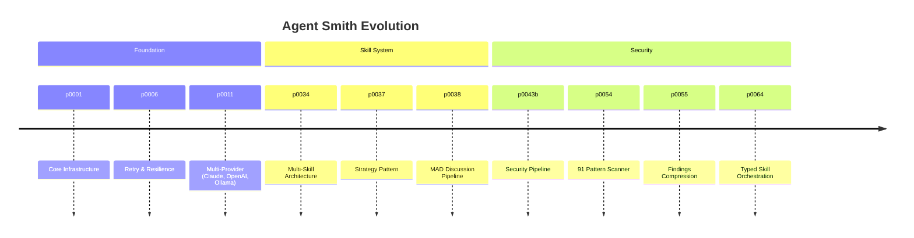

# Phases & Runs

Agent Smith tracks its own development through a structured workflow of **phases** and **runs**. This is the meta-workflow — how the project itself is planned, executed, and documented.

## The .agentsmith/ Directory

Every project that Agent Smith works on gets an `.agentsmith/` directory:

```
.agentsmith/
├── context.yaml          # Project description + state tracking
│                         #   (or contexts/<name>/context.yaml per context)
├── principles.md         # The rules the repository states
├── decisions/            # One decision YAML per phase or run
├── memory/               # Experiential memory: MEMORY.md index + one fact per file
├── specs/
│   └── github-54/        # One ticket's phase specs, written by a code run
├── phases/
│   ├── done/             # Completed phase documents
│   ├── active/           # Currently executing (max 1)
│   └── planned/          # Upcoming phases
├── wiki/                 # LLM-compiled knowledge base
│   ├── index.md          # Master index with backlinks
│   ├── decisions.md      # Compiled decisions across runs
│   ├── known-issues.md   # Recurring problems and solutions
│   ├── patterns.md       # Detected code patterns
│   └── concepts/         # Domain-specific articles
├── security/             # SARIF snapshots for trend analysis
└── runs/
    ├── 2026-05-20T22-27-43-8a3f/
    │   ├── plan.md       # The master's working plan, when it wrote one
    │   └── result.md     # Outcome with account and cost data
    └── 2026-05-20T22-29-11-4c19/
        └── result.md
```

The `wiki/` directory is maintained by the [Project Knowledge Base](knowledge-base.md) -- an LLM-compiled wiki that accumulates knowledge from all runs, decisions, and security scans.

## Phases

A **phase** is a unit of planned work — a feature, refactor, or capability addition. Each phase has its own Markdown document describing the goal, motivation, approach, files to create/modify, and definition of done.

### Phase Lifecycle

```
planned/ → active/ → done/
```

- **planned/** — documented but not started. Includes requirements, approach, and acceptance criteria.
- **active/** — currently being worked on. Only one phase can be active at a time.
- **done/** — completed. The document stays as historical reference.

### Phase Document Structure

```markdown
# Phase 52: Single Executable Release

## Goal
What we're building and why.

## Motivation
The problem this solves.

## Approach
Technical details of the implementation.

## Files to Create
- list of new files

## Files to Modify
- list of existing files to change

## Definition of Done
- [ ] Checklist of acceptance criteria
```

### Phase Tracking in context.yaml

The `state` section in `context.yaml` tracks all phases:

```yaml
state:
  done:
    p0001: "Initial pipeline: fetch ticket, checkout, plan, execute, commit"
    p0002: "Retry and resilience: Polly policies, test retry loop"
    # ...
    p0052: "Single executable release: binaries for 5 platforms, GitHub Releases"
  active: {}
  planned:
    p0023: "Multi-repo support → .agentsmith/phases/planned/p0023-multi-repo.md"
    p0025: "PR review iteration → .agentsmith/phases/planned/p0025-pr-review.md"
```

The key is the phase id; the text after it is a one-line summary, and planned phases point at their full document.

### Phases in a code run

A [`code` run](../pipelines/fix-and-feature.md) works the same way on your repository. It cuts the ticket into phase specs under `.agentsmith/specs/<provider>-<ticket-id>/` — one YAML spec and one Markdown companion per phase, plus `accounting.md` — with ids derived from the ticket: ticket 54 becomes `p54a`, `p54b`, and so on. When a phase is verified, the run writes its record to `.agentsmith/phases/done/<id>-<slug>.yaml` and adds the matching `state.done` line to the context, so the repository carries the same planned → done history this project keeps for itself.

## Runs

A **run** is a single execution of a pipeline against a ticket or task. Each run produces artifacts:

### plan.md

The coding master's own working plan, written into the run directory when it made one. The plan that the run is held to is the phase specification, not this file.

### result.md

The outcome of the run. Contains YAML frontmatter with machine-readable data:

```yaml
---
ticket: "#57 — GET /todos returns 500 when database is empty"
date: 2026-02-24
result: success
type: feat
duration_seconds: 50
tokens:
  input: 57650
  output: 9790
  cache_read: 0
  total: 67440
cost:
  total_usd: 0.0682
  phases:
    scout:
      model: claude-haiku-4-5-20251001
      input: 12450
      output: 890
      cache_read: 0
      usd: 0.0062
    primary:
      model: claude-sonnet-4-20250514
      input: 45200
      output: 8900
      cache_read: 0
      usd: 0.0620
---

## Changed Files
The source files the run changed.

## Summary
What was done.

## What this run accounted for
The delivery account, per repository.

## Decisions
Choices made during execution.

## Execution Trail
What ran, step by step.
```

A failed run's `result.md` says `result: failed` and opens with an `## Outcome` section that states why.

### Run Numbering

Run identifiers are an **ISO-8601 UTC timestamp** plus a 4-hex collision suffix — `{yyyy-MM-ddTHH-mm-ss}-{4hex}` — and the run directory is named after the id alone. Lexicographically sortable, filesystem-safe across every OS, readable in `ls`, and collision-resistant when a batch of tickets queues in the same second.

```
runs/
├── 2026-05-20T22-27-43-8a3f/
├── 2026-05-20T22-29-11-4c19/
├── 2026-05-20T23-04-02-b7d1/
└── 2026-05-21T08-17-55-2e09/
```

What the run was about lives inside `result.md`, not in the directory name, and the run history itself is in the server's database; `context.yaml` carries no run index.

Display sites render the timestamp with seconds plus the suffix (`Run 2026-05-20 22:27:43 UTC (8a3f)`) so the operator can map a header back to a directory at a glance.

Directories in the old `r{NN}` format are invisible to wiki compilation; document them in `CHANGELOG.md` if you have any.

## Agent Smith Evolution

Agent Smith itself is built using this phase workflow. The timeline below shows how the project grew from core infrastructure to a full multi-agent orchestration system:



Every one of these phases has a document in `.agentsmith/phases/done/` that explains the why, the how, and the definition of done. See [Self-Documentation](self-documentation.md) for the full picture.

## Pipeline Cost Reference

Real numbers from actual pipeline runs. Costs depend on model choice, codebase size, and finding density.

| Pipeline | LLM Calls | Avg. Cost | Tokens (in/out) | Output |
|---|---|---|---|---|
| security-scan | 9 | $0.35 | 52k / 13k | 16 confirmed findings |
| api-scan | ~12 | ~$0.45 | ~60k / 15k | SARIF + findings report |
| legal-analysis | ~6 | ~$0.25 | ~35k / 10k | German legal analysis |
| mad-discussion | ~15 | ~$0.55 | ~80k / 20k | Discussion document + PR |

!!! note "Real vs. estimated"
    The security-scan row reflects a verified run (2026-04-09, agent-smith repo, claude-sonnet-4). Other rows are estimates based on typical runs. A `code` run's cost scales with the number of phases the ticket is cut into and is fenced by a per-ticket budget sized from the scope estimate. See [Cost Tracking](cost-tracking.md) for querying your own cost history.

## The Complete Workflow

When Agent Smith processes a ticket:

1. **Specify** — cuts the ticket into phase specs on the ticket branch and posts the cut to the ticket
2. **Execute** — works one phase at a time, after checking the phase's premises
3. **Verify** — runs the repository's declared verify stages and takes the [delivery account](../../how-it-works/delivery-account.md) per phase
4. **Record** — writes the phase record, then `result.md` with the account, cost and decision data
5. **PR** — commits everything and finalizes one PR per repository

The PR reviewer sees not just the code changes but also:

- The specification the run worked from, phase by phase
- Which criteria the branch meets, with the evidence for each
- What the phase review still finds, and what the run declined
- How much it cost, and what decisions it made and why

This transparency is the point. When the agent's code breaks six months later, you'll know what it was thinking.
