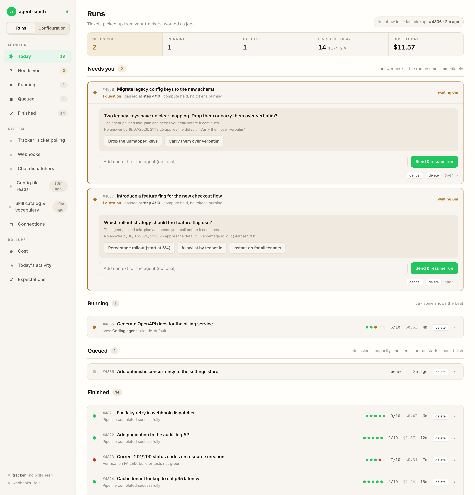
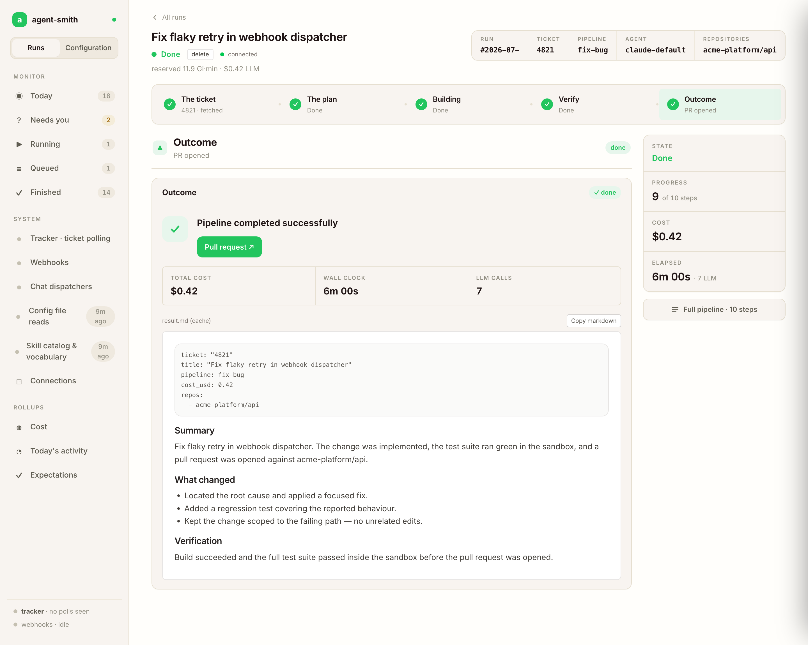
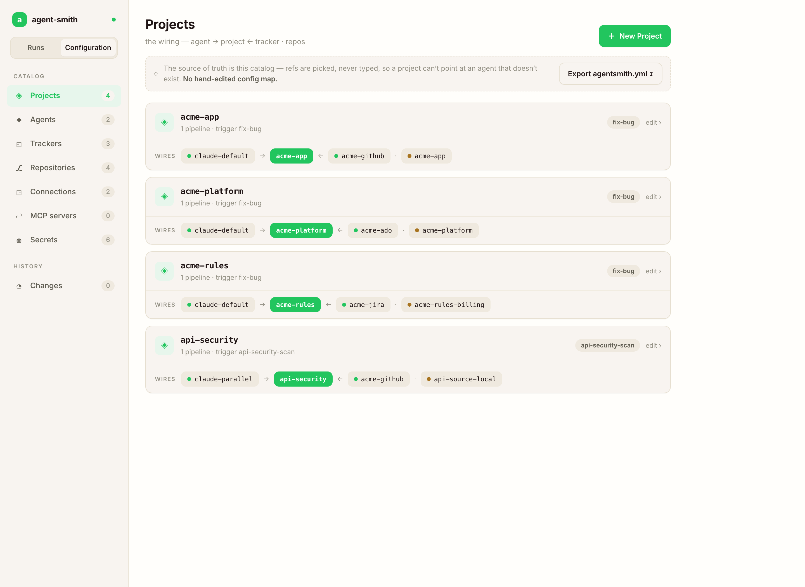

# Dashboard

The web UI for watching what Agent Smith is doing — and, just as important, what it did last Tuesday and what that cost. It reads from the server's database and event stream; the only things it writes back are a run cancel and your configuration edits.

## Running it

The dashboard is a Next.js app shipped as its own image (`holgerleichsenring/agentsmith-dashboard`), listening on port 3000.

- **docker-compose:** it's behind the `dashboard` profile — `docker compose -f deploy/docker-compose.yml --profile dashboard up -d`, then open `http://localhost:3000`.
- **Kubernetes:** `deploy/k8s/10-deployment-dashboard.yaml` + `11-service-dashboard.yaml`.

The dashboard proxies to the server (`AGENTSMITH_BACKEND_URL`, in compose `http://server:8081`) so the browser stays same-origin. The server's UI API allows loopback callers always and other origins via `AGENTSMITH_DASHBOARD_ORIGIN`. There is no built-in login — it's read-only plus cancel, and you put it behind whatever auth proxy your team already uses.

## Runs

The runs list is dense on purpose — one line per run, Azure-DevOps-style: status glyph, pipeline name, ticket title, repos, real `x/y` step progress while running, cost so far, age. Filter chips for running / queued / failed / done. New runs appear live; nothing needs a refresh.

Statuses are honest and terminal states are distinct: **done**, **failed**, **cancelled** (its own glyph, not a red herring), **queued** (amber, with `#position` in the FIFO and the reason it's waiting), and **waiting_for_input** (parked on a question — see [durable dialogue](../../how-it-works/expectations.md)).

### Run detail

One run reads as a five-beat story — **ticket → plan → build → verify → outcome** — so you get the arc before the detail; a failed run lights the beat it died in. `result.md` renders as the primary content, and the full step-by-step timeline is one click away (**Full pipeline**). What you get per run:

- **A live, unified timeline.** LLM turns and sandbox commands interleaved chronologically: what the agent thought, what it ran (`dotnet test`, `grep`, file reads/writes), what came back, per repo. The "did it actually run the tests?" question is answerable at a glance.
- **What the agent understood.** The analyzer's output — per-repo language, modules, build/test commands — and the master's `analyze.md` are shown right at their steps, before any code got written.
- **Per-step LLM cost** with model, tokens, and the **cached share** of input tokens per call. A run whose cached share is 0% has a dead prompt cache — that's an alarm, not a detail (see [cost tracking](../concepts/cost-tracking.md)).
- **Reserved capacity-time** next to the LLM cost — pod-minutes × memory request, so you see whether the run was expensive in tokens or in pods ([capacity](capacity.md)).
- **Honest per-repo outcomes.** "No changes — no PR needed" is neutral, a created PR is a clickable link, a real commit failure shows the real reason.
- **The result**, `result.md` rendered as the primary content, with `plan.md` next to it, including the ratified expectation and any `ignored_instructions`.
- **A cancel button** that enforces: graceful window, then force-kill, pods released ([cancel semantics](capacity.md#cancel-is-a-state-not-a-wish)).
- Failures lead with *why* — a cancelled run says who cancelled it (operator, watchdog, timeout), a timeout names the limit that fired instead of ".NET task was cancelled".

Sandbox names are speaking (`repo-<context>`), the header shows which agent/model is active, and every step carries a live one-liner while it works. Event history is retained so yesterday's run is still inspectable in full.

## System

The `/system` view is the answer to "is this thing alive and why didn't my ticket trigger":

- Per-subsystem status (webhooks, pollers, queue consumer, chat adapters, housekeeping) with live/idle freshness and a live event tail per subsystem.
- **The trigger log**: every received webhook and poll cycle with its verdict — actioned, or skipped with the reason (no matching project, no trigger label, signature invalid). The "why didn't this ticket trigger" question stops being a log-grepping session.
- Today's activity and cost rollups.

## Connections

System → Connections is the runtime diagnostics page (p0292/p0293): every configured connection — trackers, repo connections, LLM agents, sandbox backend, Redis, database, chat adapters — with a probe button per row and a "Test all". Probes are the cheapest authenticated call against the real dependency, so a red row is a real problem, named. Webhooks get a "secret configured / last delivery seen" panel instead of a probe button (you can't actively probe an inbound webhook from the server side).

The same probes back `agent-smith doctor` and the server's startup preflight on `/health` — one probe implementation, three consumers.

## Configuration studio

Configuration is a UI now, not only a YAML file you hand-edit. The **Configuration** tab is a relational catalog — projects, agents, trackers, repositories, connections, MCP servers, secrets — that you create and edit in place. The defining rule is **refs are picked, never typed**: a project points at its agent, tracker and repos by choosing them from the catalog, so it can't reference an agent that doesn't exist, and a connection-scoped repo ref either resolves or is flagged. No hand-edited config map, no dangling reference discovered at runtime.

Each project card shows its wiring at a glance — **agent → project ← tracker · repos** — plus the pipeline it triggers. Every change lands in **Changes** (an audit trail of what changed and when), and **Export agentsmith.yml** renders the whole catalog back to the on-disk file at any point. Secrets are referenced by name, never shown.

The YAML file stays the source of truth on disk — it's what the CLI one-shot runs read, and the studio reads and writes it through the same store — so the UI and `agentsmith.yml` never disagree. The file itself is documented under [Configuration](../configuration/index.md).

When a run behaves oddly, this is also where "what config was it actually running under" gets answered: the effective wiring, resolved and redacted.

## Catalog

The Catalog view shows the loaded skills catalog — every skill and master with its rendered SKILL.md, plus the concept vocabulary with types and definitions, and where the catalog came from (embedded, path, url, version). The run detail's "Load catalog" step shows the same for the specific run.

## Next

- [Capacity & queueing](capacity.md) — what amber "queued" means and how to size the knobs.
- [Server resilience](server-resilience.md) — `/health` vs `/health/ready`.
- [Cost tracking](../concepts/cost-tracking.md) — the numbers behind the cost columns.
