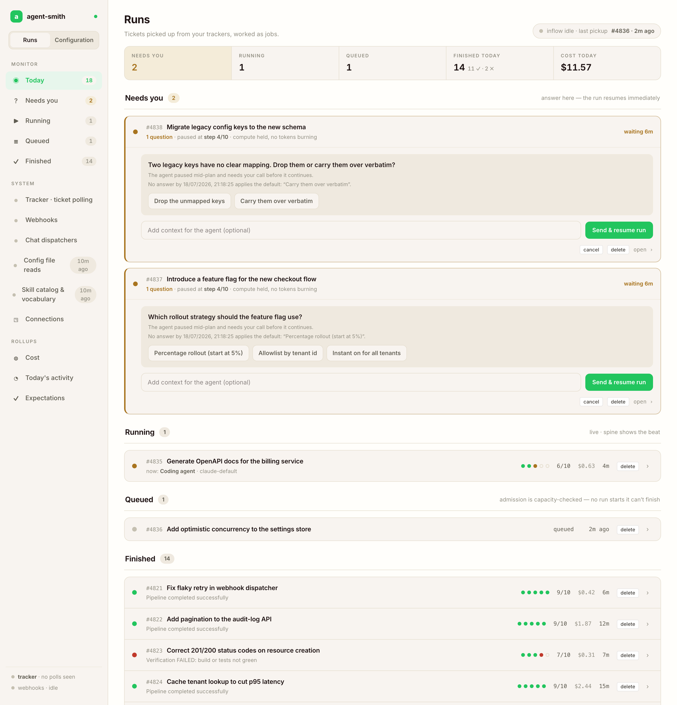
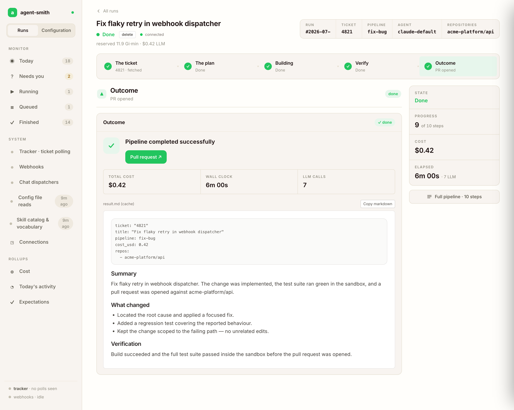
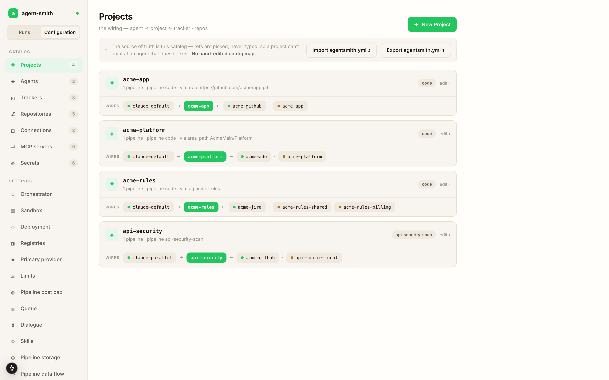

# Dashboard

The web UI for watching what Agent Smith is doing, and, just as important, what it did last Tuesday and what that cost. It reads from the server's database and live event stream. It also writes: it cancels, answers, deletes and initializes runs, and it's where the configuration is edited, because on a server the configuration lives in the database and nowhere else.



## Running it

The dashboard is a Next.js app shipped as its own image (`holgerleichsenring/agentsmith-dashboard`), listening on port 3000.

- With docker-compose it sits behind the `dashboard` profile of `deploy/docker-compose.example.yml`: `docker compose --profile dashboard up -d`, then open `http://localhost:3000`.
- On Kubernetes it's `deploy/k8s/10-deployment-dashboard.yaml` plus `11-service-dashboard.yaml`.

The dashboard proxies `/api/*` and `/hub/*` to the server (`AGENTSMITH_BACKEND_URL`, in compose `http://server:8081`), so the browser stays same-origin. The server's UI API allows loopback callers always and other origins via `AGENTSMITH_DASHBOARD_ORIGIN`.

### Sign-in

Out of the box nobody signs in and nothing is refused. Give the dashboard an OIDC authority and it signs people in itself, with the authorization code flow and PKCE, as a public client. There is no client secret, and there's nowhere to put one.

The settings are environment variables on the dashboard container:

| Variable | What it is |
|---|---|
| `AGENTSMITH_AUTH_AUTHORITY` | The OIDC authority. The same variable the server reads, so one value in a compose `.env` serves both. |
| `AGENTSMITH_AUTH_CLIENT_ID` | The public client registered for the dashboard. Without it, or without an authority, sign-in is off. |
| `AGENTSMITH_AUTH_AUDIENCE` | Sent as an `audience` parameter when set. Also shared with the server. |
| `AGENTSMITH_AUTH_SCOPES` | The scopes requested, space-separated. Defaults to `openid`. |
| `AGENTSMITH_AUTH_REDIRECT_PATH` | Where the authority sends the browser back. Defaults to `/signin-callback`. |

They're not baked into the bundle. The image's entrypoint writes them into `/app/public/runtime-settings.json` when the container starts (override the path with `AGENTSMITH_RUNTIME_SETTINGS_FILE`), so changing one is a restart, not a rebuild. That file is served to any browser that asks, which is fine for an authority and a public client id and is exactly why a secret must never go in there.

Two things only you can set, on the authority's side and in the scopes:

- Register the reply URL (`https://<dashboard>/signin-callback`, or your redirect path) as a single-page application, not as a web application. Otherwise the authority refuses the browser's own token redemption.
- Put `offline_access` in `AGENTSMITH_AUTH_SCOPES`. The session is kept in the tab's session storage and survives a reload, but without a refresh token there's nothing in it that outlives the first access token, usually an hour.

Once the server enforces sign-in, a tab with no session is sent to your organisation's sign-in page once on its own. After that, or when a session expired or its renewal was refused, the page says which of those happened and offers a **Sign in** button, instead of pretending the server is offline. The header shows the account: who is signed in, **Your identity** and **Sign out** behind it.

Two banners watch the pairing between dashboard and server. When only one half has an authority, it says "Sign-in is configured on one side only." When the two name different authorities and a token actually got refused over it, it says "The two halves of sign-in name different authorities." What the server expects is readable without a token at `GET /api/auth/requirements`, which is how the dashboard knows before anyone signs in.

A `401` renders as a sign-in state, a `403` names the permission that was missing. Who holds which permission, the identity page and the server's own `auth:` block are on [Access control](../security/access-control.md).

## The shell

Every route sits under one header and one rail. The header names the place you are on and carries the two things that belong to no single page: a gear that opens configuration in one click, and the account. Where no authority is configured there's no account to show, so nothing is shown.

The rail shows the running system and nothing that is a setting:

- **Monitor**: All runs, Needs you, Running, Queued and Finished, each with a live count. Clicking one filters the runs page, and the filter lives in the URL (`?bucket=`), so a filtered view is linkable. Below them, **Pull requests**.
- **Design**: **Work it out**, the design conversation with the agent. It has its own page: [Work it out](../../how-it-works/work-it-out.md).
- **System**: the tracker (named after the tracker it has actually seen polling), webhooks, chat dispatchers, config file reads, and the skill catalog.
- **Insight**: the Overview.

Under `/config` the same rail lists the catalog, the settings, **Permissions**, and a **This installation** group (Installation, Connection check, Changes), plus the way back to runs.

Three banners can appear above every page. A blocking startup finding shows "Running degraded", naming each finding (see [server resilience](server-resilience.md#startup-findings)). A build mismatch between the page and the server shows an advisory banner with a **Reload** button; the server withholds it for the first ten minutes after it starts, because two builds side by side is what a rolling upgrade looks like. And the sign-in banners above.

## Runs

The home page is split into the same buckets as the rail, under a strip of counts (needs you, running, queued, finished today, cost today):

- **Needs you** holds runs parked on a question. Each card opens in place with the question, quick replies and a free-text box, and **Send & resume run** resumes the same run without leaving the page. More on parking in [durable dialogue](../../how-it-works/expectations.md).
- **Running** shows each run's step progress, cost so far and age, and its story beat when the server sends one.
- **Queued** shows each run's place in line (`pos 3`) and the reason it's waiting. A parked run whose answer is in and whose relaunch is waiting for a slot moves here too and reads `resuming · pos 2`, instead of still claiming to need you.
- **Finished** pages back through history with **Load more**.

Finished runs say how they ended: done, done with a shortfall (the verified phases shipped and the rest is named as not delivered), failed, or cancelled, each distinct. Every row carries a delete button, which asks for a second click before it acts.

### Run detail



One run reads as a story of five beats, ticket, plan, building, verify and outcome, so you get the arc before the detail. A failed run lights the beat it died in. Clicking a beat switches the stage:

- **The ticket** is the ticket body as fetched.
- **The plan** is the run's `plan.md`.
- **Building** shows the progress ledger, the latest decisions and changes, and a **Phases** panel. Each finished phase opens with its **Decisions**, its steps, and **The spec it executed**.
- **Verify against acceptance** shows the delivery account, one row per acceptance criterion with its disposition, the evidence it cites and the reason. When you think a disposition is wrong you can record your own judgement with a reason. That's a label for later measurement, it doesn't re-open anything. What the account is and how it's built is on [the delivery account](../../how-it-works/delivery-account.md).
- **Outcome** renders `result.md`, with the PRs and the cost, wall-clock and LLM figures.

The rail beside the story is the run at a glance:

- **State**, **Progress** (`x of y steps`) and **Compute**, the pods the run spawned with image and memory. Until the first pod lands it shows "calculating…" and the footprint reserved at admission.
- **Cost**, next to the run's cost cap and budget tier when one was sized, with a bar that turns red at the cap.
- **Shape**, the work shape the run was classified as, with the one-line reason. It's what decided how many phases the ticket was cut into.
- **Started** as an absolute time, **Elapsed** with the number of LLM calls, and while the run works, a live **Sandbox** line with the command count and the last command.
- **Time split**: where the elapsed time went, model, sandbox, scaffolding, and how much of it was spent throttled by the rate limiter.
- The PRs the run opened, one link per repo, or a plain note that none was opened.

Below that, **Full pipeline** opens the step-by-step view. By default it shows the story steps, milestones plus gates that have something to say; internal steps and silent gates fold into one "mechanics" row per segment that expands in place. Nothing is dropped from the data, only from the default view. A running pipeline also lists the steps it hasn't reached yet, marked "The run has not reached this step yet." A step's detail follows it while it runs, shows the newest events first and lets you page back into older ones. Every step carries its LLM cost with model, tokens and the cached share of input tokens. A run whose cached share is 0% has a dead prompt cache, which is an alarm, not a detail (see [cost tracking](../concepts/cost-tracking.md)).

The header of the detail page carries **cancel** and **delete**, both with a confirming second click. Cancel enforces: graceful window, then force-kill, pods released ([cancel semantics](capacity.md#cancel-is-a-state-not-a-wish)). Failures lead with why: a cancelled run says who cancelled it, a timeout names the limit that fired.

### Why this run did that

The live view answers "what is happening". **Why this run did that** (`/jobs/{id}/why`) answers the other question, after the fact. It shows what the ticket cost, broken down by pipeline steps and by sandbox commands with count and duration, then one account per phase: its calls plotted prompt size against answer size, the commands and how they ended, and the calls in full. The recorded conversation can be read from there too.

### Deleting runs

Deleting a run removes it and everything it left behind. A run that hasn't finished is cleared first: its pod is terminated, its lease released, its queue entry dropped, and its ticket disarmed with a comment, so the next poll doesn't pick it up again as a fresh run. A finished run's ticket is left alone, that one's yours to move. If the pod can't be terminated the record is kept and the delete fails with a `502`, so you can retry once the backend answers.

The same over HTTP, both needing `runs.delete`:

```bash
curl -X DELETE https://agentsmith.example.com/api/runs/<runId>
curl -X DELETE "https://agentsmith.example.com/api/runs?state=terminal"   # every finished, failed and cancelled run
```

The bulk form only ever touches terminal runs, so it can't kill a live one.

### Retrying a handed-back ticket

A ticket the agent judged not implementable is parked and doesn't come back on a comment the way a question does. `POST /api/runs/{runId}/retry` (needs `runs.control`) moves its ticket back to a trigger status, and the poller claims it from there. The answer says whether that worked: when the tracker offers no move for the ticket, the retry is refused and the ticket keeps the hold that says why it isn't being picked up.

## Pull requests

**Pull requests** in the rail lists what the agent shipped: open today, this week and in total, then every opened PR with a link out to the provider and back to its run. Underneath, **No PR** lists the runs that produced no pull request, and why.

## Overview

**Insight → Overview** is the reading of the system rather than a part of it. Three cards over two panels:

- **Spend · 7 days**, today and the trailing week with the LLM calls behind it. The panel **Where the money went** breaks the week down by repo and pipeline. Every figure is grouped from the run list the dashboard already holds; there's no separate cost endpoint and no second truth.
- **Runs**, the same buckets the rail counts, with the finished ones split into succeeded, failed and cancelled.
- **Criteria met**, expectation hit rate and first-PR acceptance per project, from the recorded ratification outcomes. A rate never renders as 0% without a measurement.

## System

The System entries answer "is this thing alive and why didn't my ticket trigger":

- Per subsystem (tracker polling, webhooks, chat dispatchers, config reads) a status with live/idle freshness and a live event tail.
- The trigger log: every received webhook and poll cycle with its verdict, actioned, or skipped with the reason (no matching project, no trigger label, signature invalid).

## This installation

**Installation** (`/config/installation`) says which build of Agent Smith this installation runs: the server's release and revision, the dashboard's, and the sandbox agent's per project (or "not stated by this build" when a locally built image carries no stamp). Below that the skill catalog the server is **Bound to** and, labelled separately, the **Embedded floor** the binary was built against. Then the database: provider, and whether migrations are pending, with the command that applies them. The report behind the page, `GET /api/config/installation`, answers without a token, because which build is running is the question you ask when nothing else answers. The same page takes and restores [data archives](data-archive.md).

**Connection check** is the runtime diagnostics page: every configured connection (trackers, repo connections, LLM agents, sandbox backend, Redis, database, chat adapters) with a probe button per row and a "Test all". A probe is the cheapest authenticated call against the real dependency, so a red row is a real problem, named. Webhooks get a "secret configured / last delivery seen" panel instead of a probe button, since the server can't actively probe an inbound webhook. The same probes back `agent-smith doctor` and the server's startup preflight on `/health`.

**Changes** is the audit trail of every configuration change.

## Configuration studio



On a server, the database is the store of record for configuration, and this is where you edit it. Reached from the header's gear, **Configuration** is a relational catalog (projects, agents, trackers, repositories, connections, MCP servers, secrets) that you create and edit in place. Refs are picked, never typed: a project points at its agent, tracker and repos by choosing them from the catalog, so it can't reference an agent that doesn't exist, and a connection-scoped repo ref either resolves or is flagged. Changes apply while the server runs.

**Import agentsmith.yml** and **Export agentsmith.yml** move the catalog in and out of the file format the CLI reads. Secrets are referenced by name, never shown. The whole picture, including what a server still reads from the file, is on [Where configuration lives](../../configure-it/index.md) and [the Config studio](../../configure-it/config-studio.md).

## Catalog

The Catalog view shows the loaded skills catalog: every skill and master with its rendered SKILL.md, the concept vocabulary with types and definitions, and where the catalog came from. The origin line points at the setting that decides it, Settings → Skills, and says when an overlay directory on the server is layered over the source, since no setting in the dashboard changes that one. A saved change to the source shows up once the server resolves the catalog again, which the next pipeline run does. The run detail's "Load catalog" step shows the same for a specific run.

## Next

- [Capacity & queueing](capacity.md): what a queued run is waiting for and how to size the knobs.
- [Server resilience](server-resilience.md): `/health`, startup findings and the degraded banner.
- [Access control](../security/access-control.md): sign-in, roles and permissions.
- [Cost tracking](../concepts/cost-tracking.md): the numbers behind the cost columns.
