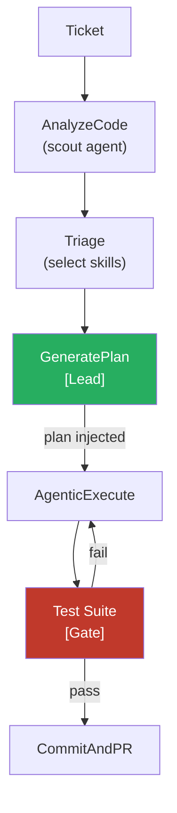

# The code pipeline

The **code** pipeline is Agent Smith's coding workflow. It takes a ticket, understands the codebase, derives a specification, writes code, verifies it, and opens a pull request.

There used to be four of these — a bug one, a feature one, a no-tests one and a phase one. They differed only in steps a specification now carries, so they were collapsed into this single preset; the ticket's label is an input to the spec rather than a choice of pipeline.

## Pipeline Steps

| # | Command | What It Does |
|---|---------|-------------|
| 1 | FetchTicket | Reads ticket from GitHub / AzDO / Jira / GitLab |
| 2 | ScopeRepos | Narrows the run to the repos the ticket affects |
| 3 | CheckoutSource | Clones each repo, creates the work branch |
| 4 | RunPreflight | Proves the sandbox and branch preconditions |
| 5 | BootstrapCheck / BootstrapGate | Refuses a repo with no `.agentsmith/` |
| 6 | LoadCodingPrinciples / LoadContext | Loads the repo's standards and context |
| 7 | AnalyzeCode | Scout agent identifies relevant files |
| 8 | DeriveSpec | Turns the ticket into an ordered set of phase specs |
| 9 | SpecHandback | Parks the ticket when the requirement contradicts the repo |
| 10 | PhaseSpecGate | Validates the spec before a single master token is spent |
| 11 | EnsurePrerequisites / ProbeTarget | Installs what the work needs, then checks the target answers |
| 12 | PhaseSequence | One master → verify → record block per derived phase |
| 13 | WriteRunResult | Writes `result.md` with token usage and cost |
| 14 | CommitAndPR / PrCrossLink | Commits, pushes, opens PRs and cross-links them |

## How Skills Collaborate

The code pipeline uses the **hierarchical pipeline** pattern. For a general overview of all pipeline orchestration patterns, see [Multi-Agent Orchestration](../concepts/multi-agent-orchestration.md).



The scout agent identifies relevant files using a cheaper model. The plan generated by the lead skill becomes part of the domain rules for the agentic execution loop. The test suite acts as a gate — if tests fail, the agent re-enters the loop to fix them.

## The Scout Agent (AnalyzeCode)

Before any code is written, the **scout agent** runs during the `AnalyzeCode` step. It uses a cheaper, faster model to scan the codebase and identify which files are relevant to the ticket.

The scout:

- Reads the code map (generated by `LoadCodeMap`)
- Reads the ticket description and any linked issues
- Searches the codebase by pattern to find related files
- Produces a focused file list that gets passed to the main agent

This keeps the main agent's context window focused on what matters, rather than dumping the entire codebase into the prompt.

## The Agentic Loop

The `AgenticExecute` step is where the AI actually writes code. It runs in an **agentic loop** — the AI calls tools, observes results, and decides what to do next.

```
┌─────────────────────────────────┐
│         AgenticExecute          │
│                                 │
│  ┌──────────┐                   │
│  │ AI Agent  │──→ read_file     │
│  │          │──→ write_file    │
│  │          │──→ search_code   │
│  │          │──→ run_command   │
│  │          │──→ list_files    │
│  │          │←── tool results  │
│  └──────────┘                   │
│       ↕                         │
│  Context compaction             │
│  (if iterations > threshold)    │
└─────────────────────────────────┘
```

### Available Tools

The agent has access to these tools during the agentic loop:

| Tool | Purpose | Example |
|------|---------|---------|
| `read_file` | Read file contents | Read a service class to understand its interface |
| `write_file` | Create or overwrite a file | Write the updated implementation |
| `search_code` | Search codebase by pattern | Find all usages of a method before renaming |
| `list_files` | List directory contents | Explore the project structure |
| `run_command` | Execute shell commands | Run `dotnet build` to check compilation |

The agent decides which tools to call, in what order, and how many iterations it needs. A typical bug fix might look like:

```
Iteration 1: read_file("src/Services/UserService.cs")
Iteration 2: search_code("GetUserById")
Iteration 3: read_file("src/Repositories/UserRepository.cs")
Iteration 4: write_file("src/Services/UserService.cs", ...)
Iteration 5: run_command("dotnet build")
```

!!! info "Tool execution"
    All tools run in the cloned repository's working directory. File paths are relative to the repo root. Shell commands execute with the repo root as the current directory.

## Retry on Test Failure

When the **Test** step fails, Agent Smith does not immediately give up. The pipeline re-enters the agentic loop with the test output, allowing the AI to fix the failing tests:

```
[11/14] AgenticExecute  ✓  (wrote code)
[12/14] Test            ✗  (3 tests failed)
         ↓ re-enter agentic loop with failure output
[12/14] AgenticExecute  ✓  (fixed failing tests)
[12/14] Test            ✓  (all tests pass)
```

!!! tip "Max retries"
    The number of test-fix cycles is bounded by the retry configuration in `agentsmith.yml`. Default is 3 attempts.

## Context Compaction

Long agentic sessions can exceed the model's context window. When the iteration count crosses `threshold_iterations`, a smaller model (e.g., Claude Haiku) summarizes the conversation so far, keeping only recent iterations verbatim:

```yaml
agent:
  compaction:
    is_enabled: true
    threshold_iterations: 8
    max_context_tokens: 80000
    keep_recent_iterations: 3
    summary_model: claude-haiku-4-5-20251001
```

This allows long-running tasks (large features, multi-file refactors) to complete without hitting token limits.

## Running

```bash
# Fix a bug from a ticket
agent-smith fix --ticket 54 --project my-project

# Add a feature, headless (no approval prompt)
agent-smith feature --ticket 12 --project my-project --headless

# Fix without running tests
agent-smith fix --ticket 54 --project my-project --no-test

# Dry run -- show pipeline steps without executing
agent-smith fix --ticket 54 --project my-project --dry-run
agent-smith feature --ticket 12 --project my-project --dry-run
```

!!! note "Headless mode"
    In `--headless` mode, the Approval step is skipped automatically. This is required for CI/CD and chat gateway usage.

## Output

On success, the pipeline produces:

- A **new branch** with the changes (e.g., `fix/54-null-ref-in-user-service`)
- A **pull request** on your Git provider with the implementation plan as description
- A **run result** in `.agentsmith/runs/r{NN}-slug/result.md` with token usage, cost, and duration
- The **ticket** is updated with the PR link and closed (if configured)
