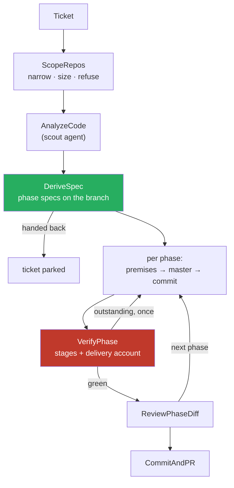

# The code pipeline

The **code** pipeline is Agent Smith's coding workflow. It takes a ticket, reads the codebase, derives a specification, works it phase by phase, verifies each phase, and opens a pull request per repository.

Bugs, features, refactors and migrations all run through it. The ticket's label is an input to the specification rather than a choice of pipeline. The names `fix-bug`, `fix-no-test`, `add-feature` and `phase-execution` no longer resolve: a server rewrites a stored configuration that still names them to `code` once at startup and says so, while a CLI `agentsmith.yml` carrying one fails until you edit it to `code`.

## Pipeline steps

| # | Command | What it does |
|---|---------|-------------|
| 1 | LoadCatalog / PipelineNameInitializer | Loads the pinned skills catalog, names the run |
| 2 | FetchTicket | Reads the ticket, its comments and attachments from GitHub / Azure DevOps / Jira / GitLab |
| 3 | ScopeRepos | Narrows the run to the repos the ticket affects, estimates its size, refuses what must not be done |
| 4 | CheckoutSource | Clones each repo, creates the work branch `agent-smith/<ticket-id>` |
| 5 | RunPreflight | Proves the run's preconditions before anything is spent on them |
| 6 | SetupRegistryAuth | Pre-stages private-feed credentials in the sandboxes |
| 7 | BootstrapCheck / BootstrapGate | Refuses a repo with no `.agentsmith/` context |
| 8 | LoadCodingPrinciples / LoadMemoryIndex / LoadDesignSystem / LoadContext | Loads the repo's principles, memory index, root DESIGN.md and context |
| 9 | AnalyzeCode | Scout agent maps the relevant code |
| 10 | DeriveSpec | Turns the ticket into an ordered set of phase specs on the ticket branch |
| 11 | SpecHandback | Parks the ticket when the derivation handed it back |
| 12 | PhaseSpecGate | Validates the spec before a single master token is spent |
| 13 | EnsurePrerequisites / ProbeTarget / MaterializeReferenceSets | Installs what the work needs, checks the target answers, and writes the websites the approval cites |
| 14 | PhaseSequence | Splices one block of steps per phase that hasn't run yet |
| 15 | WriteRunResult | Writes `result.md` with the account, token usage and cost |
| 16 | CommitAndPR / PrCrossLink | Commits, pushes, finalizes the PRs and cross-links them |

`RunPreflight` fails the run, naming the fix, when the agent configuration is the empty placeholder, when a sandbox home isn't writable, or when a declared credential is malformed or didn't arrive. A branch that already carries earlier work, or a registry whose secret resolved to nothing, is reported without stopping the run.

`ProbeTarget` runs the `probe` command a repository declares, after the prerequisites are installed and before the master starts, so a target that refuses costs no model token. Both come from the [context file](../concepts/context-file.md).

`MaterializeReferenceSets` writes every website set the approval cites into the carrying repository at `.agentsmith/reference/<setId>/`. The directory is excluded from the commit and from whole-repository searches; the master's prompt names each set. A cited set the run cannot read fails the run, naming it. A project whose `sandbox.browser.enabled` is on also gives the coding master `render_reference` and reserves one browser pod per run.

### The per-phase block

`PhaseSequence` expands into this block for every phase, in order:

| Command | What it does |
|---------|-------------|
| SelectPhase | Makes the phase current; a phase the branch already satisfies is recorded done and its work steps are skipped |
| CheckPhasePremises | A fresh instance checks what the phase says it rests on; a false premise hands the phase back |
| AgenticMaster | The coding master does the phase's work |
| MasterOpenQuestions | Parks the run when the master asked a person something |
| CommitPhaseWork | Puts the phase's work on the branch before it is judged |
| VerifyPhase | Runs the declared verify stages, then takes the delivery account |
| ReviewPhaseDiff | A fresh reviewer reads the phase diff; findings get one fix pass |
| WritePhaseRecord | Commits the phase record under `.agentsmith/phases/done/` |


```mermaid
graph TD
    Ticket --> Scope["ScopeRepos<br/>narrow · size · refuse"]
    Scope --> Analyze["AnalyzeCode<br/>(scout agent)"]
    Analyze --> Derive["DeriveSpec<br/>phase specs on the branch"]
    Derive -->|handed back| Park[ticket parked]
    Derive --> Phase["per phase:<br/>premises → master → commit"]
    Phase --> Verify["VerifyPhase<br/>stages + delivery account"]
    Verify -->|outstanding, once| Phase
    Verify -->|green| Review[ReviewPhaseDiff]
    Review -->|next phase| Phase
    Review --> PR[CommitAndPR]

    style Derive fill:#27ae60,color:#fff
    style Verify fill:#c0392b,color:#fff
```

A red phase stops the sequence; the remaining phases don't run, and delivery decides between a failure and a shortfall (see [Lifecycle](../../how-it-works/lifecycle.md#when-it-goes-wrong)).

## The specification

`DeriveSpec` writes the set to the ticket branch under `.agentsmith/specs/<provider>-<ticket-id>/`: per phase a schema-valid YAML spec and a Markdown companion that carries the verbatim parts of the ticket, plus `accounting.md`, which says for every part of the ticket which phase carries it or why it was discarded. Phase ids come from the ticket, so ticket 54 becomes `p54a`, `p54b`, and a re-run recomputes the same ids.

Before it writes, the derivation may look at the repositories through read-only tools. A cut that fails validation goes back to the model with the reason, up to three attempts; a fresh reviewer objects to cuts it doesn't accept, and if every attempt drew an objection the least-objected cut is kept and the objection is shown on the run. A cut that covers fewer of the contexts the scope call named gets one more attempt; a gap that survives it becomes a question for the author. If nothing usable comes back, the whole ticket runs as one phase and the run says why.

The cut is committed, a draft PR opens at that commit, and the cut is posted to the ticket with its criteria, facts and assumptions. The run doesn't wait on it. How you correct a cut, and how an approved specification from a design conversation is handled, is on [Expectations](../../how-it-works/expectations.md#the-done-list-is-the-expectation).

## When the ticket comes back to you

The derivation hands a ticket back instead of guessing. Each case comments on the ticket and parks it:

- **Two readings.** The comment lists both and names the one the run would take. Answer and move the ticket back to a trigger status; if the ticket comes back with nobody having answered, the run proceeds on the named reading and says so.
- **Contradicts the repository.** Parks in `needs_clarification_status`. A second contradiction with no reply on the ticket in between ends the run as a failed step: "the loop ends here".
- **Not implementable as specified.** Parks in `not_implementable_status` when you configured one, otherwise in `needs_clarification_status`. It doesn't restart on a comment; change the ticket and use Retry on the run.
- **Refused.** Raised by `ScopeRepos` before checkout, with the offending sentence quoted. If the request is legitimate, reply with why and move the ticket back; the next run reads your reply beside the ticket.

When no park status can be resolved, the run fails rather than leave the ticket claimable.

## The coding master

`AgenticMaster` runs the `coding-agent-master` skill in an agentic loop: it calls tools, observes the results, and decides what to do next. Its file tools (`read_file`, `write_file`, `edit`, `multi_edit`, `grep_in_tree`, `find_files`, `list_directory`, …) and `run_command` dispatch to the right sandbox by the first path segment, so one conversation works across all repos in scope. Besides those it has `update_progress` for its progress ledger, `ask_human` for a question that parks the run, `log_decision`, and `ensure_repo_sandbox` for a repo it didn't start with.

The master runs the repo's build and tests itself as it works; `VerifyPhase` then runs the declared stages again as the gate, and the [delivery account](../../how-it-works/delivery-account.md) judges the criteria. Long sessions are kept inside the model's window by compaction; see [Context compaction](../concepts/context-compaction.md).

!!! info "Tool execution"
    All tools run in the cloned repository's working directory. File paths are relative to the repo root. Shell commands execute with the repo root as the current directory.

## Running

```bash
# Work a ticket
agent-smith code --ticket 54 --project todolist

# No interactive prompts (what CI and cron want)
agent-smith code --ticket 54 --project todolist --headless

# Dry run -- print the pipeline steps without executing
agent-smith code --ticket 54 --project todolist --dry-run
```

`agent-smith fix` and `agent-smith feature` still work as aliases; they print a deprecation notice and run `code`. All options are on [Trigger: CLI](../../trigger-it/cli.md).

## Output

- The work branch `agent-smith/<ticket-id>` in every repo in scope, carrying the specification, the checkpoint commits, the change and the phase records.
- One **pull request** per repository with changes, opened as a draft at the spec commit and taken out of draft only by a complete, verified run. Its body carries the ticket, the per-phase table, the delivery account, what the phase review still finds, and declined criteria. A red run's PR stays a draft with a banner.
- A **run record** in `.agentsmith/runs/<run-id>/` with `result.md`, plus the master's `plan.md` where it wrote one.
- The **ticket** gets a comment with the PR links, your done status and the `agent-smith:done` label — or `agent-smith:shortfall` / `agent-smith:failed` when the run fell short.
